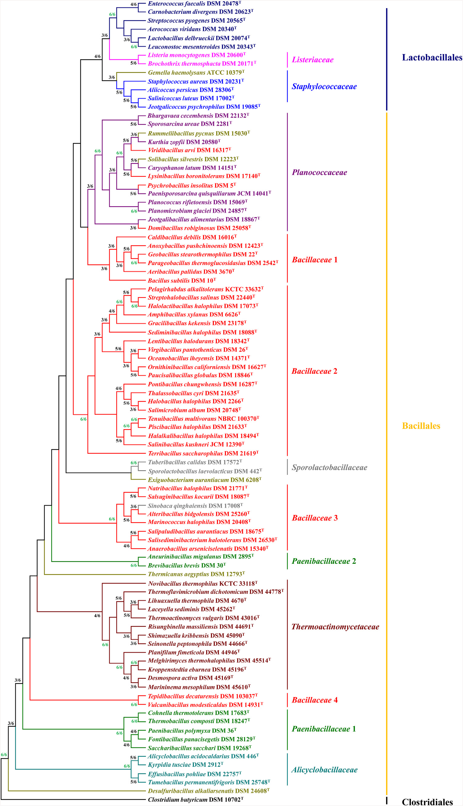

# *Bacillus*

<!-- TOC -->
* [*Bacillus*](#bacillus)
  * [Strain info](#strain-info)
    * [List all ranks](#list-all-ranks)
    * [Species with assemblies](#species-with-assemblies)
  * [Download all assemblies](#download-all-assemblies)
    * [Create assembly.tsv](#create-assemblytsv)
    * [Count before download](#count-before-download)
    * [Download and check](#download-and-check)
    * [Rsync to hpcc](#rsync-to-hpcc)
  * [BioSample](#biosample)
  * [MinHash](#minhash)
    * [Condense branches in the minhash tree](#condense-branches-in-the-minhash-tree)
  * [Count valid species and strains](#count-valid-species-and-strains)
    * [For *genomic alignments*](#for-genomic-alignments)
    * [For *protein families*](#for-protein-families)
  * [Collect proteins](#collect-proteins)
  * [Phylogenetics with bac120](#phylogenetics-with-bac120)
    * [Find corresponding representative proteins by `hmmsearch`](#find-corresponding-representative-proteins-by-hmmsearch)
    * [Domain related protein sequences](#domain-related-protein-sequences)
    * [Align and concat marker genes to create species tree](#align-and-concat-marker-genes-to-create-species-tree)
    * [Condense branches in the protein tree](#condense-branches-in-the-protein-tree)
<!-- TOC -->

## Strain info

* [Bacillus](https://www.ncbi.nlm.nih.gov/Taxonomy/Browser/wwwtax.cgi?id=1386)
* [Paenibacillus](https://www.ncbi.nlm.nih.gov/Taxonomy/Browser/wwwtax.cgi?id=44249)

A recent phylogenomics [study](https://doi.org/10.1016/j.syapm.2018.10.007) has altered our
understanding of the order Bacillales.



We include the following families:

* *Bacillaceae*
* *Paenibacillaceae*
* *Sporolactobacillaceae*
* *Thermoactinomycetaceae*
* *Alicyclobacillaceae*
* *Planococcaceae*
* *Pasteuriaceae*

* *Desulfuribacillaceae* as closet outgroups

According to a recent [publication](https://doi.org/10.1007/s10482-023-01857-6), the families below
are found to be more closely related to *Staphylococcaceae*:

- *Abyssicoccaceae*
- *Gemellaceae*
- *Listeriaceae*
- *Salinicoccaceae*

### List all ranks

```shell
mkdir -p ~/data/Bacillus
cd ~/data/Bacillus

nwr member Bacillales -r family |
    keep-header -- tsv-sort -k2,2 |
    rgr md stdin --num

nwr member \
    Bacillaceae Paenibacillaceae \
    Sporolactobacillaceae Thermoactinomycetaceae Alicyclobacillaceae \
    Planococcaceae Pasteuriaceae \
    Desulfuribacillaceae |
    tsv-summarize -H -g 3 --count |
    rgr md stdin --fmt

nwr member \
    Bacillaceae Paenibacillaceae \
    Sporolactobacillaceae Thermoactinomycetaceae Alicyclobacillaceae \
    Planococcaceae Pasteuriaceae \
    Desulfuribacillaceae \
    -r "species group" -r "species subgroup" |
    tsv-select -f 1-3 |
    keep-header -- tsv-sort -k3,3 -k2,2 |
    rgr md stdin --num

```

| #tax_id | sci_name                            | rank   | division |
|--------:|-------------------------------------|--------|----------|
| 3076164 | Abyssicoccaceae                     | family | Bacteria |
|  186823 | Alicyclobacillaceae                 | family | Bacteria |
| 3120669 | Anoxybacillaceae                    | family | Bacteria |
|  186817 | Bacillaceae                         | family | Bacteria |
|  539003 | Bacillales Family X. Incertae Sedis | family | Bacteria |
|  539738 | Gemellaceae                         | family | Bacteria |
|  186820 | Listeriaceae                        | family | Bacteria |
|  186822 | Paenibacillaceae                    | family | Bacteria |
|  538998 | Pasteuriaceae                       | family | Bacteria |
|  186818 | Planococcaceae                      | family | Bacteria |
| 3076165 | Salinicoccaceae                     | family | Bacteria |
|  186821 | Sporolactobacillaceae               | family | Bacteria |
|   90964 | Staphylococcaceae                   | family | Bacteria |
|  186824 | Thermoactinomycetaceae              | family | Bacteria |

| rank             |  count |
|------------------|-------:|
| family           |      8 |
| genus            |    212 |
| species          | 47,021 |
| subspecies       |     42 |
| no rank          |    279 |
| strain           |    769 |
| species group    |      5 |
| species subgroup |      2 |
| biotype          |      1 |

| #tax_id | sci_name                          | rank             |
|--------:|-----------------------------------|------------------|
| 1792192 | Bacillus altitudinis complex      | species group    |
|   86661 | Bacillus cereus group             | species group    |
|  653685 | Bacillus subtilis group           | species group    |
| 1505648 | Geobacillus thermoleovorans group | species group    |
| 2044880 | Paenibacillus sonchi group        | species group    |
| 1938374 | Bacillus amyloliquefaciens group  | species subgroup |
|  653388 | Bacillus mojavensis subgroup      | species subgroup |

### Species with assemblies

* 'RefSeq'
* 'Genbank'

```shell
mkdir -p ~/data/Bacillus/summary
cd ~/data/Bacillus/summary

# should have a valid name of genus
nwr member \
    Bacillaceae Paenibacillaceae \
    Sporolactobacillaceae Thermoactinomycetaceae Alicyclobacillaceae \
    Planococcaceae Pasteuriaceae \
    Desulfuribacillaceae \
    -r genus |
    sed '1d' |
    sort -n -k1,1 \
    > genus.list.tsv

wc -l genus.list.tsv
#212 genus.list.tsv

cat genus.list.tsv | cut -f 1 |
while read RANK_ID; do
    echo "
        SELECT
            species_id,
            species,
            COUNT(*) AS count
        FROM ar
        WHERE 1=1
            AND genus_id = ${RANK_ID}
        GROUP BY species_id
        HAVING count >= 1
        " |
        sqlite3 -tabs ~/.nwr/ar_refseq.sqlite
done |
    tsv-sort -k2,2 \
    > RS1.tsv

cat genus.list.tsv | cut -f 1 |
while read RANK_ID; do
    echo "
        SELECT
            species_id,
            species,
            COUNT(*) AS count
        FROM ar
        WHERE 1=1
            AND genus_id = ${RANK_ID}
        GROUP BY species_id
        HAVING count >= 1
        " |
        sqlite3 -tabs ~/.nwr/ar_genbank.sqlite
done |
    tsv-sort -k2,2 \
    > GB1.tsv

wc -l RS*.tsv GB*.tsv
#  3940 RS1.tsv
#  4332 GB1.tsv

for C in RS GB; do
    for N in $(seq 1 1 10); do
        if [ -e "${C}${N}.tsv" ]; then
            printf "${C}${N}\t"
            cat ${C}${N}.tsv |
                tsv-summarize --sum 3
        fi
    done
done
#RS1     15147
#GB1     20472

```

## Download all assemblies

### Create assembly.tsv

If a refseq assembly is available, the corresponding genbank one is not downloaded

```shell
cd ~/data/Bacillus/summary

echo "
.headers ON
    SELECT
        *
    FROM ar
    WHERE 1=1
        AND genus IN ('Bacillus', 'Staphylococcus', 'Listeria')
        AND refseq_category IN ('reference genome')
    " |
    sqlite3 -tabs ~/.nwr/ar_refseq.sqlite |
    tsv-join -H -d assembly_accession -f ~/Scripts/genomes/assembly/Bacteria.reference.tsv -k assembly_accession |
    tsv-select -H -f organism_name,species,genus,ftp_path,biosample,assembly_level,assembly_accession \
    > raw.tsv

# RS
SPECIES=$(
    cat RS1.tsv |
        cut -f 1 |
        tr "\n" "," |
        sed 's/,$//'
)

echo "
    SELECT
        species || ' ' || infraspecific_name || ' ' || assembly_accession AS name,
        species, genus, ftp_path, biosample, assembly_level,
        assembly_accession
    FROM ar
    WHERE 1=1
        AND species_id IN ($SPECIES)
        AND species NOT LIKE '% sp.%'
        AND species NOT LIKE '% x %'
    " |
    sqlite3 -tabs ~/.nwr/ar_refseq.sqlite \
    >> raw.tsv

echo "
    SELECT
        genus || ' sp. ' || infraspecific_name || ' ' || assembly_accession AS name,
        genus || ' sp.', genus, ftp_path, biosample, assembly_level,
        assembly_accession
    FROM ar
    WHERE 1=1
        AND species_id IN ($SPECIES)
        AND species LIKE '% sp.%'
    " |
    sqlite3 -tabs ~/.nwr/ar_refseq.sqlite \
    >> raw.tsv

# Preference for refseq
cat raw.tsv |
    tsv-select -H -f "assembly_accession" \
    > rs.acc.tsv

# GB
SPECIES=$(
    cat GB1.tsv |
        cut -f 1 |
        tr "\n" "," |
        sed 's/,$//'
)

echo "
    SELECT
        species || ' ' || infraspecific_name || ' ' || assembly_accession AS name,
        species, genus, ftp_path, biosample, assembly_level,
        gbrs_paired_asm
    FROM ar
    WHERE 1=1
        AND species_id IN ($SPECIES)
        AND species NOT LIKE '% sp.%'
        AND species NOT LIKE '% x %'
    " |
    sqlite3 -tabs ~/.nwr/ar_genbank.sqlite |
    tsv-join -f rs.acc.tsv -k 1 -d 7 -e \
    >> raw.tsv

echo "
    SELECT
        genus || ' sp. ' || infraspecific_name || ' ' || assembly_accession AS name,
        genus || ' sp.', genus, ftp_path, biosample, assembly_level,
        gbrs_paired_asm
    FROM ar
    WHERE 1=1
        AND species_id IN ($SPECIES)
        AND species LIKE '% sp.%'
    " |
    sqlite3 -tabs ~/.nwr/ar_genbank.sqlite |
    tsv-join -f rs.acc.tsv -k 1 -d 7 -e \
    >> raw.tsv

cat raw.tsv |
    rgr dedup stdin |
    datamash check
#20478 lines, 7 fields

# Create abbr.
cat raw.tsv |
    grep -v '^#' |
    rgr dedup stdin |
    tsv-select -f 1-6 |
    perl ~/Scripts/genomes/bin/abbr_name.pl -c "1,2,3" -s '\t' -m 3 --shortsub |
    (echo -e '#name\tftp_path\tbiosample\tspecies\tassembly_level' && cat ) |
    perl -nl -a -F"," -e '
        BEGIN{my %seen};
        /^#/ and print and next;
        /^organism_name/i and next;
        $seen{$F[3]}++; # ftp_path
        $seen{$F[3]} > 1 and next;
        $seen{$F[6]}++; # abbr_name
        $seen{$F[6]} > 1 and next;
        printf qq{%s\t%s\t%s\t%s\t%s\n}, $F[6], $F[3], $F[4], $F[1], $F[5];
        ' |
    tsv-filter --or --str-in-fld 2:ftp --str-in-fld 2:http |
    keep-header -- tsv-sort -k4,4 -k1,1 \
    > Bacillus.assembly.tsv

datamash check < Bacillus.assembly.tsv
#20466 lines, 5 fields

# find potential duplicate strains or assemblies
cat Bacillus.assembly.tsv |
    tsv-uniq -f 1 --repeated

cat Bacillus.assembly.tsv |
    tsv-filter --str-not-in-fld 2:ftp

# Edit .assembly.tsv, remove unnecessary strains, check strain names and comment out poor assemblies.
# vim Bacillus.assembly.tsv
#
# Save the file to another directory to prevent accidentally changing it
# cp Bacillus.assembly.tsv ~/Scripts/genomes/assembly

# Cleaning
rm raw*.*sv

```

### Count before download

* `strains.taxon.tsv` - taxonomy info: species, genus, family, order, and class

```shell
cd ~/data/Bacillus

nwr template ~/Scripts/genomes/assembly/Bacillus.assembly.tsv \
    --count \
    --rank genus

# strains.taxon.tsv and taxa.tsv
bash Count/strains.sh

cat Count/taxa.tsv |
    rgr md stdin --fmt

# .lst and .count.tsv
bash Count/rank.sh

mv Count/genus.count.tsv Count/genus.before.tsv

cat Count/genus.before.tsv |
    keep-header -- tsv-sort -k1,1 |
    tsv-filter -H --ge 3:50 |
    rgr md stdin --num

```

| item    |  count |
|---------|-------:|
| strain  | 18,912 |
| species |  1,541 |
| genus   |    199 |
| family  |     10 |
| order   |      2 |
| class   |      2 |

| genus            | #species | #strains |
|------------------|---------:|---------:|
| Alicyclobacillus |       28 |       72 |
| Anoxybacillus    |       18 |      113 |
| Bacillus         |      136 |    12019 |
| Brevibacillus    |       30 |      270 |
| Cohnella         |       37 |       66 |
| Cytobacillus     |       19 |      154 |
| Fictibacillus    |       16 |       56 |
| Geobacillus      |       17 |      187 |
| Halobacillus     |       25 |       62 |
| Heyndrickxia     |       13 |      196 |
| Kurthia          |       10 |       52 |
| Lysinibacillus   |       28 |      438 |
| Metabacillus     |       22 |       62 |
| Neobacillus      |       27 |      127 |
| Niallia          |        8 |       77 |
| Oceanobacillus   |       35 |      105 |
| Paenibacillus    |      316 |     1975 |
| Peribacillus     |       19 |      259 |
| Planococcus      |       29 |       81 |
| Priestia         |       10 |      654 |
| Psychrobacillus  |       10 |       56 |
| Rossellomorea    |        7 |       78 |
| Shouchella       |       12 |       77 |
| Solibacillus     |       10 |       52 |
| Sporosarcina     |       27 |      133 |
| Virgibacillus    |       34 |      124 |

### Download and check

```shell
cd ~/data/Bacillus

ulimit -n `ulimit -Hn`

nwr template ~/Scripts/genomes/assembly/Bacillus.assembly.tsv \
    --ass

# Run
bash ASSEMBLY/rsync.sh

# Check md5; create check.lst
# rm ASSEMBLY/check.lst
bash ASSEMBLY/check.sh

## Put the misplaced directories into the right ones
#bash ASSEMBLY/reorder.sh
#
## This operation will delete some files in the directory, so please be careful
#cat ASSEMBLY/remove.lst |
#    parallel --no-run-if-empty --linebuffer -k -j 1 '
#        if [[ -e "ASSEMBLY/{}" ]]; then
#            echo Remove {}
#            rm -fr "ASSEMBLY/{}"
#        fi
#    '

# N50 C S; create n50.tsv and n50.pass.tsv
bash ASSEMBLY/n50.sh 50000 500 500000

# Adjust parameters passed to `n50.sh`
cat ASSEMBLY/n50.tsv |
    tsv-filter -H --str-in-fld "name:_GCF_" |
    tsv-summarize -H --min "N50" --max "C" --min "S"
#N50_min C_max   S_min
#5966    1976    1073956

cat ASSEMBLY/n50.tsv |
    tsv-summarize -H --quantile "N50:0.1,0.5" --quantile "C:0.5,0.9" --quantile "S:0.1,0.5" |
    datamash transpose
#N50_pct10       55738
#N50_pct50       313185
#C_pct50 55
#C_pct90 267
#S_pct10 3699089.6
#S_pct50 5109679

# After the above steps are completed, run the following commands.

# Collect; create collect.tsv
bash ASSEMBLY/collect.sh

# After all completed
bash ASSEMBLY/finish.sh

cp ASSEMBLY/collect.pass.tsv summary/

cat ASSEMBLY/counts.tsv |
    rgr md stdin --fmt

```

| #item            | fields |  lines |
|------------------|-------:|-------:|
| url.tsv          |      3 | 20,465 |
| check.lst        |      1 | 20,465 |
| collect.tsv      |     20 | 20,466 |
| n50.tsv          |      4 | 20,466 |
| n50.pass.tsv     |      4 | 18,581 |
| collect.pass.tsv |     23 | 18,581 |
| pass.lst         |      1 | 18,580 |
| omit.lst         |      1 |    804 |
| rep.lst          |      1 |  1,270 |
| sp.lst           |      1 |  2,830 |

### Rsync to hpcc

```shell
rsync -avP \
    ~/data/Bacillus/ \
    wangq@202.119.37.251:data/Bacillus

rsync -avP \
    -e 'ssh -p 8804' \
    ~/data/Bacillus/ \
    wangq@58.213.64.36:data/Bacillus

# rsync -avP wangq@202.119.37.251:data/Bacillus/ ~/data/Bacillus

```

## BioSample

```shell
cd ~/data/Bacillus

ulimit -n `ulimit -Hn`

nwr template ~/Scripts/genomes/assembly/Bacillus.assembly.tsv \
    --bs

# Run this script twice and it will re-download the failed files
bash BioSample/download.sh

# Ignore rare attributes
bash BioSample/collect.sh 50

datamash check < BioSample/biosample.tsv
#20439 lines, 102 fields

cp BioSample/attributes.lst summary/
cp BioSample/biosample.tsv summary/

```

## MinHash

```shell
cd ~/data/Bacillus

nwr template ~/Scripts/genomes/assembly/Bacillus.assembly.tsv \
    --mh \
    --parallel 8 \
    --in ASSEMBLY/pass.lst \
    --ani-ab 0.05 \
    --ani-nr 0.005

# Compute assembly sketches
bash MinHash/compute.sh

# Non-redundant strains within species
bash MinHash/nr.sh

find MinHash -name "NR.lst" |
    xargs cat |
    sort |
    uniq \
    > summary/NR.lst
find MinHash -name "redundant.lst" |
    xargs cat |
    sort |
    uniq \
    > summary/redundant.lst
wc -l summary/NR.lst summary/redundant.lst
#  8019 summary/NR.lst
#  9718 summary/redundant.lst

# Abnormal strains
bash MinHash/abnormal.sh

cat MinHash/abnormal.lst | wc -l
#1157

cat MinHash/abnormal.lst |
    tsv-join -e -f ASSEMBLY/sp.lst \
    > MinHash/tmp.lst
mv MinHash/tmp.lst MinHash/abnormal.lst
cat MinHash/abnormal.lst | wc -l
#372

# Distances between all selected sketches, then hierarchical clustering
cd ~/data/Bacillus/

nwr template ~/Scripts/genomes/assembly/Bacillus.assembly.tsv \
    --mh \
    --parallel 8 \
    --in ASSEMBLY/rep.lst \
    --not-in ASSEMBLY/sp.lst \
    --not-in MinHash/abnormal.lst \
    --not-in summary/redundant.lst \
    --height 0.4

bash MinHash/dist.sh

```

### Condense branches in the minhash tree

```shell
mkdir -p ~/data/Bacillus/tree
cd ~/data/Bacillus/tree

nw_reroot ../MinHash/tree.nwk Desu_alkalia_AHT28_GCF_001730225_1 Desu_sti_MLFW_2_GCF_001742305_1 |
    nwr order stdin --nd --an \
    > minhash.reroot.newick

nwr pl-condense --map -r family -r genus \
    minhash.reroot.newick ../MinHash/species.tsv |
    nwr order stdin --nd --an \
    > minhash.condensed.newick

mv condensed.tsv minhash.condensed.tsv

# svg
nwr topo --bl minhash.condensed.newick | # remove comments
    nw_display -s -b 'visibility:hidden' -w 1200 -v 20 - \
    > Bacillus.minhash.svg

```

## Count valid species and strains

### For *genomic alignments*

```shell
cd ~/data/Bacillus/

nwr template ~/Scripts/genomes/assembly/Bacillus.assembly.tsv \
    --count \
    --in ASSEMBLY/pass.lst \
    --not-in MinHash/abnormal.lst \
    --rank family --rank genus \
    --lineage family --lineage genus

# strains.taxon.tsv and taxa.tsv
bash Count/strains.sh

cat Count/taxa.tsv |
    rgr md stdin --num

# .lst and .count.tsv
bash Count/rank.sh

cat Count/family.count.tsv |
    tsv-filter -H --ge "3:20" |
    rgr md stdin --num

cat Count/genus.count.tsv |
    tsv-filter -H --ge "3:20" |
    rgr md stdin --num

# Can accept N_COUNT
bash Count/lineage.sh 10

cat Count/lineage.count.tsv |
    rgr md stdin --num

# copy to summary/
cp Count/strains.taxon.tsv summary/genome.taxon.tsv

```

| item    | count |
|---------|------:|
| strain  | 16827 |
| species |  1507 |
| genus   |   196 |
| family  |    10 |
| order   |     2 |
| class   |     2 |

| family                 | #species | #strains |
|------------------------|---------:|---------:|
| Alicyclobacillaceae    |       49 |       84 |
| Bacillaceae            |      823 |    14046 |
| Paenibacillaceae       |      419 |     2163 |
| Planococcaceae         |      141 |      399 |
| Sporolactobacillaceae  |       25 |       47 |
| Thermoactinomycetaceae |       45 |       83 |

| genus                 | #species | #strains |
|-----------------------|---------:|---------:|
| Aeribacillus          |        3 |       24 |
| Alicyclobacillus      |       28 |       56 |
| Alkalihalobacillus    |        8 |       23 |
| Aneurinibacillus      |        8 |       41 |
| Anoxybacillus         |       16 |       67 |
| Bacillus              |      135 |    11014 |
| Brevibacillus         |       30 |      248 |
| Caldifermentibacillus |        1 |       22 |
| Cohnella              |       37 |       60 |
| Cytobacillus          |       19 |      124 |
| Fictibacillus         |       16 |       48 |
| Geobacillus           |       17 |      119 |
| Gracilibacillus       |       22 |       30 |
| Halalkalibacter       |       13 |       24 |
| Halobacillus          |       25 |       56 |
| Heyndrickxia          |       13 |      132 |
| Kurthia               |        9 |       32 |
| Lederbergia           |       10 |       20 |
| Lentibacillus         |       17 |       23 |
| Lysinibacillus        |       28 |      352 |
| Mesobacillus          |       11 |       27 |
| Metabacillus          |       22 |       54 |
| Neobacillus           |       26 |       87 |
| Niallia               |        8 |       67 |
| Oceanobacillus        |       35 |       97 |
| Paenibacillus         |      311 |     1768 |
| Parageobacillus       |        8 |       41 |
| Peribacillus          |       19 |      223 |
| Planococcus           |       29 |       57 |
| Priestia              |       10 |      573 |
| Psychrobacillus       |       10 |       48 |
| Rossellomorea         |        7 |       49 |
| Schinkia              |        1 |       24 |
| Shouchella            |       12 |       73 |
| Siminovitchia         |        8 |       20 |
| Solibacillus          |       10 |       42 |
| Sporolactobacillus    |       13 |       32 |
| Sporosarcina          |       27 |      119 |
| Terribacillus         |        5 |       25 |
| Thermoactinomyces     |        5 |       28 |
| Ureibacillus          |       13 |       35 |
| Virgibacillus         |       34 |      110 |

| #family                | genus                                     | species                             | count |
|------------------------|-------------------------------------------|-------------------------------------|------:|
| Bacillaceae            | Aeribacillus                              | Aeribacillus sp.                    |    11 |
|                        | Alkalihalobacillus                        | Alkalihalobacillus sp.              |    12 |
|                        | Anoxybacillus                             | Anoxybacillus sp.                   |    23 |
|                        | Bacillus                                  | Bacillus albus                      |    33 |
|                        |                                           | Bacillus altitudinis                |   244 |
|                        |                                           | Bacillus amyloliquefaciens          |   250 |
|                        |                                           | Bacillus anthracis                  |   870 |
|                        |                                           | Bacillus atrophaeus                 |   169 |
|                        |                                           | Bacillus badius                     |    12 |
|                        |                                           | Bacillus bombysepticus              |    11 |
|                        |                                           | Bacillus cereus                     |  2361 |
|                        |                                           | Bacillus cytotoxicus                |    43 |
|                        |                                           | Bacillus glycinifermentans          |    15 |
|                        |                                           | Bacillus halotolerans               |    75 |
|                        |                                           | Bacillus haynesii                   |   133 |
|                        |                                           | Bacillus inaquosorum                |   136 |
|                        |                                           | Bacillus infantis                   |    11 |
|                        |                                           | Bacillus licheniformis              |   383 |
|                        |                                           | Bacillus mobilis                    |    88 |
|                        |                                           | Bacillus mojavensis                 |    41 |
|                        |                                           | Bacillus mycoides                   |   184 |
|                        |                                           | Bacillus nitratireducens            |    19 |
|                        |                                           | Bacillus pacificus                  |   102 |
|                        |                                           | Bacillus paralicheniformis          |   220 |
|                        |                                           | Bacillus paramycoides               |    18 |
|                        |                                           | Bacillus paranthracis               |   314 |
|                        |                                           | Bacillus pseudomycoides             |   112 |
|                        |                                           | Bacillus pumilus                    |   272 |
|                        |                                           | Bacillus safensis                   |   252 |
|                        |                                           | Bacillus siamensis                  |    22 |
|                        |                                           | Bacillus sonorensis                 |    38 |
|                        |                                           | Bacillus spizizenii                 |   192 |
|                        |                                           | Bacillus stercoris                  |    19 |
|                        |                                           | Bacillus stratosphericus            |    11 |
|                        |                                           | Bacillus subtilis                   |  1189 |
|                        |                                           | Bacillus swezeyi                    |    14 |
|                        |                                           | Bacillus thuringiensis              |  1175 |
|                        |                                           | Bacillus toyonensis                 |   323 |
|                        |                                           | Bacillus tropicus                   |    66 |
|                        |                                           | Bacillus vallismortis               |    15 |
|                        |                                           | Bacillus velezensis                 |  1143 |
|                        |                                           | Bacillus wiedmannii                 |   239 |
|                        | Caldibacillus                             | Caldibacillus thermoamylovorans     |    11 |
|                        | Caldifermentibacillus                     | Caldifermentibacillus hisashii      |    22 |
|                        | Cytobacillus                              | Cytobacillus firmus                 |    39 |
|                        |                                           | Cytobacillus kochii                 |    11 |
|                        |                                           | Cytobacillus oceanisediminis        |    13 |
|                        |                                           | Cytobacillus sp.                    |    27 |
|                        | Fictibacillus                             | Fictibacillus sp.                   |    14 |
|                        | Geobacillus                               | Geobacillus sp.                     |    44 |
|                        |                                           | Geobacillus stearothermophilus      |    17 |
|                        |                                           | Geobacillus thermodenitrificans     |    13 |
|                        |                                           | Geobacillus thermoleovorans         |    12 |
|                        | Halalkalibacterium (ex Joshi et al. 2022) | Halalkalibacterium halodurans       |    16 |
|                        | Halobacillus                              | Halobacillus sp.                    |    13 |
|                        | Heyndrickxia                              | Heyndrickxia coagulans              |    58 |
|                        |                                           | Heyndrickxia faecalis               |    10 |
|                        |                                           | Heyndrickxia oleronia               |    15 |
|                        |                                           | Heyndrickxia sp.                    |    18 |
|                        |                                           | Heyndrickxia sporothermodurans      |    16 |
|                        | Lysinibacillus                            | Lysinibacillus capsici              |    42 |
|                        |                                           | Lysinibacillus fusiformis           |    82 |
|                        |                                           | Lysinibacillus sp.                  |   115 |
|                        |                                           | Lysinibacillus sphaericus           |    42 |
|                        |                                           | Lysinibacillus xylanilyticus        |    14 |
|                        | Neobacillus                               | Neobacillus sp.                     |    30 |
|                        | Niallia                                   | Niallia circulans                   |    25 |
|                        |                                           | Niallia sp.                         |    19 |
|                        |                                           | Niallia taxi                        |    14 |
|                        | Oceanobacillus                            | Oceanobacillus sp.                  |    23 |
|                        | Parageobacillus                           | Parageobacillus thermoglucosidasius |    18 |
|                        | Peribacillus                              | Peribacillus butanolivorans         |    21 |
|                        |                                           | Peribacillus frigoritolerans        |    83 |
|                        |                                           | Peribacillus simplex                |    40 |
|                        |                                           | Peribacillus sp.                    |    47 |
|                        | Priestia                                  | Priestia aryabhattai                |   109 |
|                        |                                           | Priestia endophytica                |    12 |
|                        |                                           | Priestia filamentosa                |    11 |
|                        |                                           | Priestia flexa                      |    25 |
|                        |                                           | Priestia megaterium                 |   372 |
|                        |                                           | Priestia sp.                        |    34 |
|                        | Psychrobacillus                           | Psychrobacillus sp.                 |    34 |
|                        | Rossellomorea                             | Rossellomorea marisflavi            |    22 |
|                        |                                           | Rossellomorea sp.                   |    13 |
|                        | Schinkia                                  | Schinkia azotoformans               |    24 |
|                        | Shouchella                                | Shouchella clausii                  |    57 |
|                        | Terribacillus                             | Terribacillus saccharophilus        |    13 |
|                        | Virgibacillus                             | Virgibacillus halodenitrificans     |    13 |
|                        |                                           | Virgibacillus pantothenticus        |    22 |
|                        |                                           | Virgibacillus sp.                   |    20 |
| Paenibacillaceae       | Aneurinibacillus                          | Aneurinibacillus aneurinilyticus    |    10 |
|                        |                                           | Aneurinibacillus migulanus          |    11 |
|                        | Brevibacillus                             | Brevibacillus agri                  |    24 |
|                        |                                           | Brevibacillus borstelensis          |    24 |
|                        |                                           | Brevibacillus brevis                |    17 |
|                        |                                           | Brevibacillus formosus              |    10 |
|                        |                                           | Brevibacillus laterosporus          |    50 |
|                        |                                           | Brevibacillus parabrevis            |    11 |
|                        |                                           | Brevibacillus sp.                   |    49 |
|                        | Cohnella                                  | Cohnella sp.                        |    17 |
|                        | Paenibacillus                             | Paenibacillus alvei                 |    18 |
|                        |                                           | Paenibacillus amylolyticus          |    16 |
|                        |                                           | Paenibacillus apiarius              |    11 |
|                        |                                           | Paenibacillus chitinolyticus        |    13 |
|                        |                                           | Paenibacillus dendritiformis        |    11 |
|                        |                                           | Paenibacillus glucanolyticus        |    14 |
|                        |                                           | Paenibacillus ihbetae               |    12 |
|                        |                                           | Paenibacillus lactis                |    13 |
|                        |                                           | Paenibacillus larvae                |   389 |
|                        |                                           | Paenibacillus lautus                |    13 |
|                        |                                           | Paenibacillus macerans              |    10 |
|                        |                                           | Paenibacillus odorifer              |    36 |
|                        |                                           | Paenibacillus peoriae               |    11 |
|                        |                                           | Paenibacillus polymyxa              |   108 |
|                        |                                           | Paenibacillus sp.                   |   576 |
|                        |                                           | Paenibacillus thiaminolyticus       |    27 |
|                        |                                           | Paenibacillus xylanexedens          |    10 |
| Planococcaceae         | Kurthia                                   | Kurthia gibsonii                    |    10 |
|                        | Solibacillus                              | Solibacillus sp.                    |    28 |
|                        | Sporosarcina                              | Sporosarcina sp.                    |    68 |
|                        | Ureibacillus                              | Ureibacillus sp.                    |    11 |
| Sporolactobacillaceae  | Sporolactobacillus                        | Sporolactobacillus sp.              |    10 |
| Thermoactinomycetaceae | Thermoactinomyces                         | Thermoactinomyces sp.               |    14 |

### For *protein families*

```shell
cd ~/data/Bacillus/

nwr template ~/Scripts/genomes/assembly/Bacillus.assembly.tsv \
    --count \
    --in ASSEMBLY/pass.lst \
    --not-in MinHash/abnormal.lst \
    --not-in ASSEMBLY/omit.lst \
    --rank genus

# strains.taxon.tsv and taxa.tsv
bash Count/strains.sh

cat Count/taxa.tsv |
    rgr md stdin --num

# .lst and .count.tsv
bash Count/rank.sh

cat Count/genus.count.tsv |
    tsv-filter -H --ge "3:20" |
    rgr md stdin --num

# copy to summary/
cp Count/strains.taxon.tsv summary/protein.taxon.tsv

```

| item    | count |
|---------|------:|
| strain  | 16423 |
| species |  1499 |
| genus   |   196 |
| family  |    10 |
| order   |     2 |
| class   |     2 |

| genus                 | #species | #strains |
|-----------------------|---------:|---------:|
| Aeribacillus          |        3 |       24 |
| Alicyclobacillus      |       28 |       56 |
| Alkalihalobacillus    |        8 |       22 |
| Aneurinibacillus      |        8 |       39 |
| Anoxybacillus         |       16 |       65 |
| Bacillus              |      133 |    10763 |
| Brevibacillus         |       30 |      244 |
| Caldifermentibacillus |        1 |       22 |
| Cohnella              |       37 |       59 |
| Cytobacillus          |       19 |      122 |
| Fictibacillus         |       16 |       46 |
| Geobacillus           |       17 |      117 |
| Gracilibacillus       |       22 |       29 |
| Halalkalibacter       |       13 |       24 |
| Halobacillus          |       25 |       56 |
| Heyndrickxia          |       13 |      130 |
| Kurthia               |        8 |       28 |
| Lederbergia           |       10 |       20 |
| Lentibacillus         |       16 |       22 |
| Lysinibacillus        |       28 |      301 |
| Mesobacillus          |       11 |       27 |
| Metabacillus          |       22 |       54 |
| Neobacillus           |       26 |       87 |
| Niallia               |        8 |       67 |
| Oceanobacillus        |       35 |       94 |
| Paenibacillus         |      310 |     1734 |
| Parageobacillus       |        8 |       41 |
| Peribacillus          |       19 |      221 |
| Planococcus           |       29 |       57 |
| Priestia              |       10 |      561 |
| Psychrobacillus       |       10 |       48 |
| Rossellomorea         |        7 |       49 |
| Schinkia              |        1 |       24 |
| Shouchella            |       12 |       72 |
| Solibacillus          |        9 |       41 |
| Sporolactobacillus    |       13 |       32 |
| Sporosarcina          |       27 |      113 |
| Terribacillus         |        5 |       24 |
| Thermoactinomyces     |        5 |       27 |
| Ureibacillus          |       13 |       34 |
| Virgibacillus         |       34 |      108 |

## Collect proteins

```shell
cd ~/data/Bacillus/

nwr template ~/Scripts/genomes/assembly/Bacillus.assembly.tsv \
    --pro \
    --parallel 8 \
    --in ASSEMBLY/pass.lst \
    --not-in ASSEMBLY/omit.lst

# collect proteins
bash Protein/collect.sh

# clustering
# It may need to be run several times
bash Protein/cluster.sh

rm -fr Protein/tmp/

# info.tsv
bash Protein/info.sh

# counts
bash Protein/count.sh

cat Protein/counts.tsv |
    tsv-summarize -H --count --sum 2-7 |
    sed 's/^count/species/' |
    datamash transpose |
    (echo -e "#item\tcount" && cat) |
    rgr md stdin --fmt

```

| #item      |      count |
|------------|-----------:|
| species    |      1,504 |
| strain_sum |     18,102 |
| total_sum  | 87,106,072 |
| dedup_sum  | 42,320,155 |
| rep_sum    | 13,931,528 |
| fam88_sum  | 10,662,583 |
| fam38_sum  |  7,306,809 |

## Phylogenetics with bac120

```shell
cd ~/data/Bacillus/

# The Bacteria HMM set
nwr kb bac120 -o HMM
cp HMM/bac120.lst HMM/marker.lst

```

### Find corresponding representative proteins by `hmmsearch`

```shell
cd ~/data/Bacillus

cat Protein/species.tsv |
    tsv-join -f ASSEMBLY/pass.lst -k 1 |
    tsv-join -e -f ASSEMBLY/sp.lst -k 1 |
    tsv-join -e -f ASSEMBLY/omit.lst -k 1 \
    > Protein/species-f.tsv

cat Protein/species-f.tsv |
    tsv-select -f 2 |
    rgr dedup stdin |
while read SPECIES; do
    if [[ -s Protein/"${SPECIES}"/bac120.tsv ]]; then
        continue
    fi
    if [[ ! -f Protein/"${SPECIES}"/rep_seq.fa.gz ]]; then
        continue
    fi

    echo >&2 "${SPECIES}"

    cat HMM/marker.lst |
        parallel --colsep '\t' --no-run-if-empty --linebuffer -k -j 8 "
            gzip -dcf Protein/${SPECIES}/rep_seq.fa.gz |
                hmmsearch --cut_nc --noali --notextw HMM/hmm/{}.HMM - |
                grep '>>' |
                perl -nl -e ' m(>>\s+(\S+)) and printf qq(%s\t%s\n), q({}), \$1; '
        " \
        > Protein/${SPECIES}/bac120.tsv
done

cat Protein/species-f.tsv |
    tsv-select -f 2 |
    rgr dedup stdin |
while read SPECIES; do
    if [[ ! -s Protein/"${SPECIES}"/bac120.tsv ]]; then
        continue
    fi
    if [[ ! -f Protein/"${SPECIES}"/seq.sqlite ]]; then
        continue
    fi

    echo >&2 "${SPECIES}"

    nwr seqdb -d Protein/${SPECIES} --rep f3=Protein/${SPECIES}/bac120.tsv

done

```

### Domain related protein sequences

```shell
cd ~/data/Bacillus

mkdir -p Domain

# each assembly
cat Protein/species-f.tsv |
    tsv-select -f 2 |
    rgr dedup stdin |
while read SPECIES; do
    if [[ ! -f Protein/"${SPECIES}"/seq.sqlite ]]; then
        continue
    fi

    echo >&2 "${SPECIES}"

    echo "
        SELECT
            seq.name,
            asm.name,
            rep.f3
        FROM asm_seq
        JOIN rep_seq ON asm_seq.seq_id = rep_seq.seq_id
        JOIN seq ON asm_seq.seq_id = seq.id
        JOIN rep ON rep_seq.rep_id = rep.id
        JOIN asm ON asm_seq.asm_id = asm.id
        WHERE 1=1
            AND rep.f3 IS NOT NULL
        ORDER BY
            asm.name,
            rep.f3
        " |
        sqlite3 -tabs Protein/${SPECIES}/seq.sqlite \
        > Protein/${SPECIES}/seq_asm_f3.tsv

    hnsm some Protein/"${SPECIES}"/pro.fa.gz <(
            tsv-select -f 1 Protein/"${SPECIES}"/seq_asm_f3.tsv |
            rgr dedup stdin
        )
done |
    hnsm dedup stdin |
    hnsm gz stdin -o Domain/bac120.fa

fd --full-path "Protein/.+/seq_asm_f3.tsv" -X cat \
    > Domain/seq_asm_f3.tsv

cat Domain/seq_asm_f3.tsv |
    tsv-join -e -d 2 -f summary/redundant.lst -k 1 |
    tsv-join -e -d 2 -f ASSEMBLY/sp.lst -k 1 \
    > Domain/seq_asm_f3.NR.tsv

```

### Align and concat marker genes to create species tree

```shell
cd ~/data/Bacillus

# Extract proteins
cat HMM/marker.lst |
    parallel --no-run-if-empty --linebuffer -k -j 4 '
        echo >&2 "==> marker [{}]"

        mkdir -p Domain/{}

        hnsm some Domain/bac120.fa.gz <(
            cat Domain/seq_asm_f3.tsv |
                tsv-filter --str-eq "3:{}" |
                tsv-select -f 1 |
                rgr dedup stdin
            ) \
            > Domain/{}/{}.pro.fa
    '

# Align each marker
cat HMM/marker.lst |
    parallel --no-run-if-empty --linebuffer -k -j 8 '
        echo >&2 "==> marker [{}]"
        if [ ! -s Domain/{}/{}.pro.fa ]; then
            exit
        fi
        if [ -s Domain/{}/{}.aln.fa ]; then
            exit
        fi

#        muscle -quiet -in Domain/{}/{}.pro.fa -out Domain/{}/{}.aln.fa
        mafft --auto Domain/{}/{}.pro.fa > Domain/{}/{}.aln.fa
    '

cat HMM/marker.lst |
while read marker; do
    echo >&2 "==> marker [${marker}]"
    if [ ! -s Domain/${marker}/${marker}.pro.fa ]; then
        continue
    fi

    # sometimes `muscle` can not produce alignments
    if [ ! -s Domain/${marker}/${marker}.aln.fa ]; then
        continue
    fi

    # Only NR strains
    # 1 name to many names
    cat Domain/seq_asm_f3.NR.tsv |
        tsv-filter --str-eq "3:${marker}" |
        tsv-select -f 1-2 |
        hnsm replace -s Domain/${marker}/${marker}.aln.fa stdin \
        > Domain/${marker}/${marker}.replace.fa
done

# Concat marker genes
cat HMM/marker.lst |
while read marker; do
    if [ ! -s Domain/${marker}/${marker}.pro.fa ]; then
        continue
    fi
    if [ ! -s Domain/${marker}/${marker}.aln.fa ]; then
        continue
    fi

    cat Domain/${marker}/${marker}.replace.fa

    # empty line for .fas
    echo
done \
    > Domain/bac120.aln.fas

cat Domain/seq_asm_f3.NR.tsv |
    cut -f 2 |
    rgr dedup stdin |
    sort |
    fasops concat Domain/bac120.aln.fas stdin -o Domain/bac120.aln.fa

# Trim poorly aligned regions with `TrimAl`
trimal -in Domain/bac120.aln.fa -out Domain/bac120.trim.fa -automated1

hnsm size Domain/bac120.*.fa |
    rgr dedup stdin -f 2 |
    cut -f 2
#98638
#43956

# To make it faster
FastTree -fastest -noml Domain/bac120.trim.fa > Domain/bac120.trim.newick

```

### Condense branches in the protein tree

```shell
cd ~/data/Bacillus/tree

nw_reroot  ../Domain/bac120.trim.newick Desu_alkalia_AHT28_GCF_001730225_1 Desu_sti_MLFW_2_GCF_001742305_1 |
    nwr order stdin --nd --an \
    > bac120.reroot.newick

nwr pl-condense --map -r order -r family -r genus \
    bac120.reroot.newick ../Count/species.tsv |
    nwr order stdin --nd --an \
    -o bac120.condensed.newick

mv condensed.tsv bac120.condense.tsv

# svg
nwr topo --bl bac120.condensed.newick | # remove comments
    nw_display -s -b 'visibility:hidden' -w 1200 -v 20 - \
    > Bacillus.bac120.svg

```
