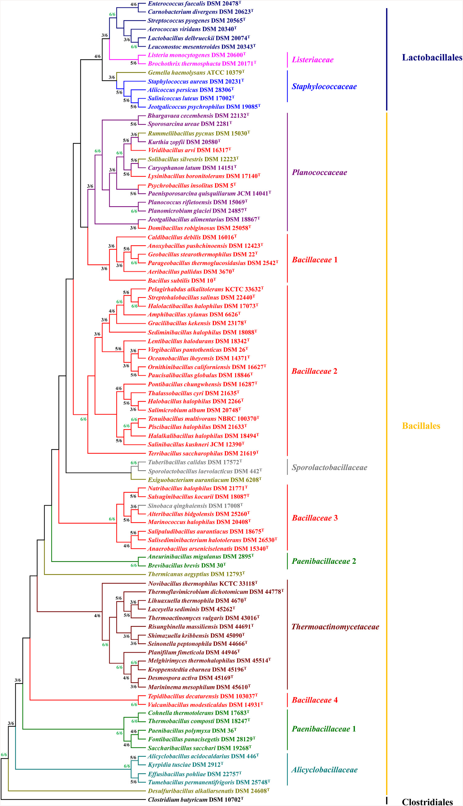
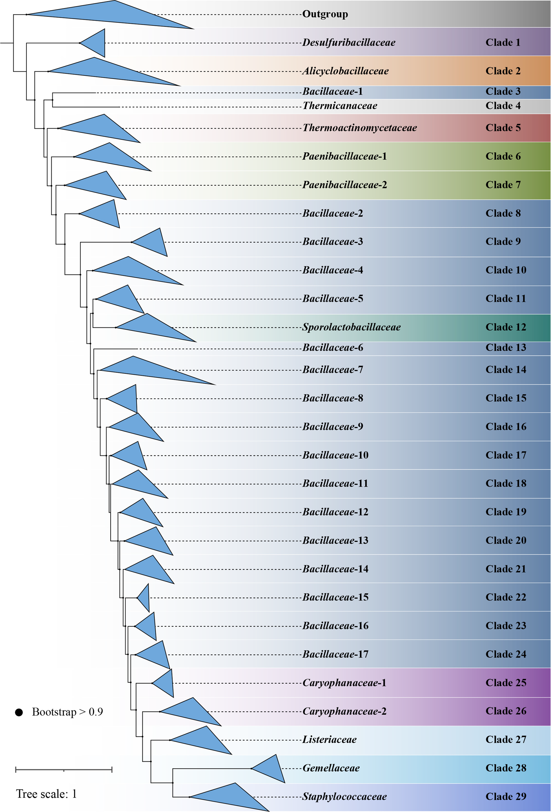

# *Bacillus*

[TOC levels=2-4]: #

  * [Strain info](#strain-info)
    * [List all ranks](#list-all-ranks)
    * [Species with assemblies](#species-with-assemblies)
  * [Download all assemblies](#download-all-assemblies)
    * [Create assembly.tsv](#create-assemblytsv)
    * [Count before download](#count-before-download)
    * [Download and check](#download-and-check)
    * [Rsync to hpcc](#rsync-to-hpcc)
  * [BioSample](#biosample)
  * [MinHash](#minhash)
    * [Condense branches in the minhash tree](#condense-branches-in-the-minhash-tree)
  * [Count valid species and strains](#count-valid-species-and-strains)
    * [For *genomic alignments*](#for-genomic-alignments)
    * [For *protein families*](#for-protein-families)
  * [Collect proteins](#collect-proteins)
  * [Phylogenetics with bac120](#phylogenetics-with-bac120)
    * [Find corresponding representative proteins by `hmmsearch`](#find-corresponding-representative-proteins-by-hmmsearch)
    * [Domain related protein sequences](#domain-related-protein-sequences)
    * [Align and concat marker genes to create species tree](#align-and-concat-marker-genes-to-create-species-tree)
    * [Condense branches in the protein tree](#condense-branches-in-the-protein-tree)

## Strain info

* [Bacillus](https://www.ncbi.nlm.nih.gov/Taxonomy/Browser/wwwtax.cgi?id=1386)
* [Paenibacillus](https://www.ncbi.nlm.nih.gov/Taxonomy/Browser/wwwtax.cgi?id=44249)

De Maayer et al. (2019) re-evaluated the taxonomy of the order Bacillales using phylogenomic analysis of 80 representative genomes ([Syst. Appl. Microbiol.](https://doi.org/10.1016/j.syapm.2018.10.007)). Key findings include: (1) the families Bacillaceae and Paenibacillaceae are polyphyletic, forming four and two distinct clades respectively; and (2) Staphylococcaceae and Listeriaceae cluster within the sister order Lactobacillales rather than Bacillales.



Bello et al. (2023) subsequently reorganized the Staphylococcaceae complex (now placed in Lactobacillales), proposing an emended Staphylococcaceae alongside three new families: Abyssicoccaceae, Salinicoccaceae, and Gemellaceae ([Antonie van Leeuwenhoek](https://doi.org/10.1007/s10482-023-01857-6)).

More recently, Li et al. (2024) performed a comprehensive reclassification of the order (whose correct name under nomenclatural priority is Caryophanales) based on 1,080 genome sequences, establishing 41 families including 12 newly proposed ones ([IJSEM](https://doi.org/10.1099/ijsem.0.006539)).



We include the following families within Caryophanales:

* Bacillaceae 芽孢杆菌科
* Paenibacillaceae 类芽孢杆菌科
* Sporolactobacillaceae 芽孢乳杆菌科
* Thermoactinomycetaceae 高温放线菌科
* Alicyclobacillaceae 脂环酸芽孢杆菌科
* Caryophanaceae (Planococcaceae)
* Pasteuriaceae
* Domibacillaceae
* Fictibacillaceae
* Guptibacillaceae

* Desulfuribacillaceae as closest outgroup

Exclude the following families from the analysis:

* Listeriaceae
- Gemellaceae
* Staphylococcaceae
* Abyssicoccaceae
* Salinicoccaceae

### List all ranks

```shell
mkdir -p ~/data/Bacillus
cd ~/data/Bacillus

nwr member Bacillales -r family |
    tva sort -H -k 2 |
    tva to md --num

nwr member Bacillales |
    nwr restrict -e Listeriaceae |
    nwr restrict -e Gemellaceae |
    nwr restrict -e Staphylococcaceae |
    nwr restrict -e Abyssicoccaceae |
    nwr restrict -e Salinicoccaceae |
    tva stats -H -g 3 --count |
    tva to md --num

nwr member Bacillales \
    -r "species group" -r "species subgroup" |
    tva select -f 1-3 |
    tva sort -H -k 3,2 |
    tva to md --num

```

| #tax_id | sci_name                            | rank   | division |
| ------: | ----------------------------------- | ------ | -------- |
| 3076164 | Abyssicoccaceae                     | family | Bacteria |
|  186823 | Alicyclobacillaceae                 | family | Bacteria |
| 3120669 | Anoxybacillaceae                    | family | Bacteria |
|  186817 | Bacillaceae                         | family | Bacteria |
|  539003 | Bacillales Family X. Incertae Sedis | family | Bacteria |
|  186818 | Caryophanaceae                      | family | Bacteria |
| 3383080 | Domibacillaceae                     | family | Bacteria |
| 3120697 | Fictibacillaceae                    | family | Bacteria |
|  539738 | Gemellaceae                         | family | Bacteria |
| 3421337 | Guptibacillaceae                    | family | Bacteria |
|  186820 | Listeriaceae                        | family | Bacteria |
|  186822 | Paenibacillaceae                    | family | Bacteria |
|  538998 | Pasteuriaceae                       | family | Bacteria |
| 3076165 | Salinicoccaceae                     | family | Bacteria |
|  186821 | Sporolactobacillaceae               | family | Bacteria |
|   90964 | Staphylococcaceae                   | family | Bacteria |
|  186824 | Thermoactinomycetaceae              | family | Bacteria |

| rank             | count |
| ---------------- | ----: |
| order            |     1 |
| family           |    12 |
| genus            |   233 |
| species          | 50431 |
| no rank          |   303 |
| strain           |   789 |
| subspecies       |    43 |
| species group    |     5 |
| species subgroup |     2 |
| biotype          |     1 |

| #tax_id | sci_name                              | rank             |
| ------: | ------------------------------------- | ---------------- |
| 1792192 | Bacillus altitudinis complex          | species group    |
|   86661 | Bacillus cereus group                 | species group    |
|  653685 | Bacillus subtilis group               | species group    |
| 1505648 | Geobacillus thermoleovorans group     | species group    |
| 2044880 | Paenibacillus sonchi group            | species group    |
| 3239053 | Staphylococcus cohnii species complex | species group    |
| 2815305 | Staphylococcus intermedius group      | species group    |
| 1938374 | Bacillus amyloliquefaciens group      | species subgroup |
|  653388 | Bacillus mojavensis subgroup          | species subgroup |

### Species with assemblies

Incomplete genomes are retained here for gene cluster mining.

* 'RefSeq'
* 'Genbank'

```shell
mkdir -p ~/data/Bacillus/summary
cd ~/data/Bacillus/summary

# should have a valid name of genus
nwr member Bacillales Desulfuribacillales -r genus |
    sed '1d' |
    tva sort -n -k 1 \
    > genus.list.tsv

wc -l genus.list.tsv
#251 genus.list.tsv

cat genus.list.tsv | tva select -f 1 |
while read RANK_ID; do
    echo "
        SELECT
            species_id,
            species,
            COUNT(*) AS count
        FROM ar
        WHERE 1=1
            AND genus_id = ${RANK_ID}
        GROUP BY species_id
        HAVING count >= 1
        " |
        sqlite3 -tabs ~/.nwr/ar_refseq.sqlite
done |
    tva sort -k 2 \
    > RS1.tsv

cat genus.list.tsv | tva select -f 1 |
while read RANK_ID; do
    echo "
        SELECT
            species_id,
            species,
            COUNT(*) AS count
        FROM ar
        WHERE 1=1
            AND genus_id = ${RANK_ID}
        GROUP BY species_id
        HAVING count >= 1
        " |
        sqlite3 -tabs ~/.nwr/ar_genbank.sqlite
done |
    tva sort -k 2 \
    > GB1.tsv

wc -l RS*.tsv GB*.tsv
# 6099 RS1.tsv
# 6741 GB1.tsv

for C in RS GB; do
    for N in $(seq 1 1 10); do
        if [ -e "${C}${N}.tsv" ]; then
            printf "${C}${N}\t"
            cat ${C}${N}.tsv |
                tva stats --sum 3
        fi
    done
done
# RS1	57371
# GB1	244321
```

## Download all assemblies

### Create assembly.tsv

If a refseq assembly is available, the corresponding genbank one is not downloaded

```shell
cd ~/data/Bacillus/summary

echo "
.headers ON
    SELECT
        *
    FROM ar
    WHERE 1=1
        AND species IN ('Bacillus subtilis', 'Bacillus thuringiensis', 'Staphylococcus aureus', 'Listeria monocytogenes')
        AND refseq_category IN ('reference genome')
    " |
    sqlite3 -tabs ~/.nwr/ar_refseq.sqlite |
    tva select -H -f organism_name,species,genus,ftp_path,biosample,assembly_level,assembly_accession \
    > raw.tsv

# RS
SPECIES=$(
    cat RS1.tsv |
        tva select -f 1 |
        tr "\n" "," |
        sed 's/,$//'
)

echo "
    SELECT
        species || ' ' || infraspecific_name || ' ' || assembly_accession AS name,
        species, genus, ftp_path, biosample, assembly_level,
        assembly_accession
    FROM ar
    WHERE 1=1
        AND species_id IN ($SPECIES)
        AND species NOT LIKE '% sp.%'
    " |
    sqlite3 -tabs ~/.nwr/ar_refseq.sqlite \
    >> raw.tsv

echo "
    SELECT
        genus || ' sp. ' || infraspecific_name || ' ' || assembly_accession AS name,
        genus || ' sp.', genus, ftp_path, biosample, assembly_level,
        assembly_accession
    FROM ar
    WHERE 1=1
        AND species_id IN ($SPECIES)
        AND species LIKE '% sp.%'
    " |
    sqlite3 -tabs ~/.nwr/ar_refseq.sqlite \
    >> raw.tsv

# Preference for refseq
cat raw.tsv |
    tva select -H -f "assembly_accession" \
    > rs.acc.tsv

# GB
SPECIES=$(
    cat GB1.tsv |
        tva select -f 1 |
        tr "\n" "," |
        sed 's/,$//'
)

echo "
    SELECT
        species || ' ' || infraspecific_name || ' ' || assembly_accession AS name,
        species, genus, ftp_path, biosample, assembly_level,
        gbrs_paired_asm
    FROM ar
    WHERE 1=1
        AND species_id IN ($SPECIES)
        AND species NOT LIKE '% sp.%'
    " |
    sqlite3 -tabs ~/.nwr/ar_genbank.sqlite |
    tva join -f rs.acc.tsv -k 1 -d 7 -e \
    >> raw.tsv

echo "
    SELECT
        genus || ' sp. ' || infraspecific_name || ' ' || assembly_accession AS name,
        genus || ' sp.', genus, ftp_path, biosample, assembly_level,
        gbrs_paired_asm
    FROM ar
    WHERE 1=1
        AND species_id IN ($SPECIES)
        AND species LIKE '% sp.%'
    " |
    sqlite3 -tabs ~/.nwr/ar_genbank.sqlite |
    tva join -f rs.acc.tsv -k 1 -d 7 -e \
    >> raw.tsv

cat raw.tsv |
    tva uniq |
    tva check
#244327 lines, 7 fields

# Create abbr.
cat raw.tsv |
    grep -v '^#' |
    tva uniq |
    tva select -f 1-6 |
    nwr abbr -c "1,2,3" -m 3 --shortsub |
    tva uniq -H -f ftp_path |
    tva uniq -H -f 7 |
    sed '1d' |
    tva select -f 7,4,5,2,6 |
    (echo -e '#name\tftp_path\tbiosample\tspecies\tassembly_level' && cat ) |
    tva filter -H --or --str-in-fld 2:ftp --str-in-fld 2:http |
    tva sort -H -k 4,1 \
    > Bacillus.assembly.tsv

tva check < Bacillus.assembly.tsv
#244322 lines, 5 fields

# find potential duplicate strains or assemblies
cat Bacillus.assembly.tsv |
    tva uniq -f 1 --repeated

cat Bacillus.assembly.tsv |
    tva filter --str-not-in-fld 2:ftp

# Edit .assembly.tsv, remove unnecessary strains, check strain names and comment out poor assemblies.
# vim Bacillus.assembly.tsv
#
# Save the file to another directory to prevent accidentally changing it
# cp Bacillus.assembly.tsv ~/Scripts/genomes/assembly

# Cleaning
rm raw*.*sv
```

### Count before download

* `strains.taxon.tsv` - taxonomy info: species, genus, family, order, and class

```shell
cd ~/data/Bacillus

nwr template ~/Scripts/genomes/assembly/Bacillus.assembly.tsv \
    --count \
    --rank genus

# strains.taxon.tsv and taxa.tsv
bash Count/strains.sh

cat Count/taxa.tsv |
    tva to md --fmt

# .lst and .count.tsv
bash Count/rank.sh

mv Count/genus.count.tsv Count/genus.before.tsv

cat Count/genus.before.tsv |
    tva sort -H -k 1 |
    tva filter -H --ge 3:100 |
    tva to md --fmt
```

| item    |   count |
| ------- | ------: |
| strain  | 241,927 |
| species |   1,862 |
| genus   |     233 |
| family  |      18 |
| order   |       2 |
| class   |       2 |

| genus           | #species | #strains |
| --------------- | -------: | -------: |
| Anoxybacillus   |       13 |      100 |
| Bacillus        |      141 |   15,383 |
| Brevibacillus   |       34 |      391 |
| Cytobacillus    |       19 |      189 |
| Exiguobacterium |       19 |      388 |
| Gemella         |        9 |      157 |
| Geobacillus     |       17 |      241 |
| Heyndrickxia    |       13 |      262 |
| Listeria        |       25 |   75,462 |
| Lysinibacillus  |       29 |      557 |
| Macrococcoides  |        4 |      114 |
| Mammaliicoccus  |        6 |      609 |
| Neobacillus     |       33 |      155 |
| Niallia         |        9 |      100 |
| Oceanobacillus  |       36 |      118 |
| Paenibacillus   |      336 |    2,336 |
| Peribacillus    |       21 |      359 |
| Priestia        |       11 |      910 |
| Rossellomorea   |       11 |      120 |
| Sporosarcina    |       27 |      150 |
| Staphylococcus  |       77 |  140,877 |
| Virgibacillus   |       36 |      141 |

### Download and check

```shell
cd ~/data/Bacillus

ulimit -n `ulimit -Hn`

nwr template ~/Scripts/genomes/assembly/Bacillus.assembly.tsv \
    --ass

# Run
bash ASSEMBLY/aria2.sh

# Check md5; create check.lst
# rm ASSEMBLY/check.lst
bash ASSEMBLY/check.sh

# Remove failed directories and re-download
bash ASSEMBLY/check.sh 2>&1 |
    grep "checksum failed" |
    sed 's/.*==> //;s/ checksum failed <==//' |
    parallel --no-run-if-empty --linebuffer -k -j 1 '
        dir=$(cat ASSEMBLY/url.tsv | tva filter --str-eq "1:{}" | tva select -f 3,1 | tr "\t" "/")
        if [[ -n "$dir" && -e "ASSEMBLY/$dir" ]]; then
            echo Remove ASSEMBLY/$dir
            rm -fr "ASSEMBLY/$dir"
        fi
    '

# # Put the misplaced directory into the right place
# bash ASSEMBLY/reorder.sh

# # This operation will delete some files in the directory, so please be careful
# cat ASSEMBLY/remove.lst |
#    parallel --no-run-if-empty --linebuffer -k -j 1 '
#        if [[ -e "ASSEMBLY/{}" ]]; then
#            echo Remove {}
#            rm -fr "ASSEMBLY/{}"
#        fi
#    '

find ASSEMBLY/ -name "*_genomic.fna.gz" |
    grep -v "_from_" |
    wc -l
#26830

# N50 C S; create n50.tsv and n50.pass.tsv
bash ASSEMBLY/n50.sh 50000 500 500000

# Adjust parameters passed to `n50.sh`
cat ASSEMBLY/n50.tsv |
    tva filter -H --str-in-fld "name:_GCF_" |
    tva stats -H --min "N50" --max "C" --min "S" |
    tva transpose
# N50_min	5622
# C_max	1976
# S_min	1879126

cat ASSEMBLY/n50.tsv |
    tva stats -H --quantile "N50:0.1,0.5" --quantile "C:0.5,0.9" --quantile "S:0.1,0.5" |
    tva transpose
# N50_quantile_0.1	57651.3
# N50_quantile_0.5	334497
# C_quantile_0.5	51
# C_quantile_0.9	252
# S_quantile_0.1	3666503.7
# S_quantile_0.5	5067627.5

# After the above steps are completed, run the following commands.

# Collect; create collect.tsv
bash ASSEMBLY/collect.sh

# After all completed
bash ASSEMBLY/finish.sh

cp ASSEMBLY/collect.pass.tsv summary/
cp ASSEMBLY/omit.lst summary/
cp ASSEMBLY/pass.lst summary/
cp ASSEMBLY/sp.lst summary/
cp ASSEMBLY/rep.lst summary/

cat ASSEMBLY/counts.tsv |
    tva to md --fmt
```

| #item            | fields |  lines |
| ---------------- | -----: | -----: |
| url.tsv          |      3 | 26,831 |
| check.lst        |      1 | 26,831 |
| collect.tsv      |     20 | 26,832 |
| n50.pass.tsv     |      4 | 24,461 |
| collect.pass.tsv |     23 | 24,461 |
| pass.lst         |      1 | 24,460 |
| omit.lst         |      1 |  1,085 |
| rep.lst          |      1 |  1,494 |
| sp.lst           |      1 |  4,260 |

### Rsync to hpcc

```shell
rsync -avP \
    ~/data/Bacillus/ \
    wangq@202.119.37.251:data/Bacillus

rsync -avP \
    -e 'ssh -p 8804' \
    ~/data/Bacillus/ \
    wangq@58.213.64.36:data/Bacillus

# rsync -avP wangq@202.119.37.251:data/Bacillus/ ~/data/Bacillus
```

## BioSample

```shell
cd ~/data/Bacillus

ulimit -n `ulimit -Hn`

nwr template ~/Scripts/genomes/assembly/Bacillus.assembly.tsv \
    --bs

# Run this script twice and it will re-download the failed files
bash BioSample/download.sh

# Ignore rare attributes
bash BioSample/collect.sh 50

tva check < BioSample/biosample.tsv
#26805 lines, 136 fields

cp BioSample/attributes.lst summary/
cp BioSample/biosample.tsv summary/
```

## MinHash

```shell
cd ~/data/Bacillus

nwr template ~/Scripts/genomes/assembly/Bacillus.assembly.tsv \
    --mh \
    --parallel 8 \
    --in summary/pass.lst \
    --ani-ab 0.05 \
    --ani-nr 0.005

# Compute assembly sketches
bash MinHash/compute.sh

# Non-redundant strains within species
bash MinHash/nr.sh

fd --full-path "MinHash/.+/NR.lst" -X cat |
    sort |
    uniq \
    > summary/NR.lst
fd --full-path "MinHash/.+/redundant.lst" -X cat |
    sort |
    uniq \
    > summary/redundant.lst
wc -l summary/NR.lst summary/redundant.lst
#    10161 summary/NR.lst
#    13438 summary/redundant.lst

# Abnormal strains
bash MinHash/abnormal.sh

cat MinHash/abnormal.lst |
    tva join -e -f summary/sp.lst \
    > MinHash/tmp.lst
mv MinHash/tmp.lst summary/abnormal.lst

wc -l MinHash/abnormal.lst summary/abnormal.lst
# 1429 MinHash/abnormal.lst
#  467 summary/abnormal.lst

# Distances between all selected sketches, then hierarchical clustering
cd ~/data/Bacillus/

nwr template ~/Scripts/genomes/assembly/Bacillus.assembly.tsv \
    --mh \
    --parallel 8 \
    --in summary/rep.lst \
    --not-in summary/sp.lst \
    --not-in summary/abnormal.lst \
    --not-in summary/redundant.lst \
    --height 0.4

bash MinHash/dist.sh
```

### Condense branches in the minhash tree

```shell
mkdir -p ~/data/Bacillus/tree
cd ~/data/Bacillus/tree

pgr nwk reroot ../MinHash/tree.nwk -n Desu_alkalia_AHT28_GCF_001730225_1 -n Desu_stib_MLFW_2_GCF_001742305_1 |
    pgr nwk order stdin --nd --an \
    > minhash.reroot.newick

pgr pl condense --map -t ../Count/strains.taxon.tsv -r 4 -r 3 \
    minhash.reroot.newick |
    pgr nwk order stdin --nd --an \
    > minhash.condensed.newick

mv condensed.tsv minhash.condensed.tsv

# svg
pgr nwk to-svg minhash.condensed.newick \
    > Bacillus.minhash.svg
```

## Count valid species and strains

### For *genomic alignments*

```shell
cd ~/data/Bacillus/

nwr template ~/Scripts/genomes/assembly/Bacillus.assembly.tsv \
    --count \
    --in summary/pass.lst \
    --not-in summary/abnormal.lst \
    --rank family --rank genus \
    --lineage family --lineage genus

# strains.taxon.tsv
bash Count/strains.sh

cat Count/taxa.tsv |
    tva to md --num

# .lst and .count.tsv
bash Count/rank.sh

cat Count/family.count.tsv |
    tva filter -H --ge "3:50" |
    tva to md --num

cat Count/genus.count.tsv |
    tva filter -H --ge "3:50" |
    tva to md --num

# Can accept N_COUNT
bash Count/lineage.sh 50

cat Count/lineage.count.tsv |
    tva to md --num

# copy to summary/
cp Count/strains.taxon.tsv summary/genome.taxon.tsv
cp Count/genus.count.tsv summary/genus.genome.tsv
```

| item    | count |
| ------- | ----: |
| strain  | 21835 |
| species |  1642 |
| genus   |   215 |
| family  |    15 |
| order   |     2 |
| class   |     2 |

| family                 | #species | #strains |
| ---------------------- | -------: | -------: |
| Alicyclobacillaceae    |       47 |       86 |
| Anoxybacillaceae       |       46 |      282 |
| Bacillaceae            |      823 |    17844 |
| Caryophanaceae         |      146 |      474 |
| Fictibacillaceae       |       21 |       66 |
| Paenibacillaceae       |      447 |     2609 |
| Sporolactobacillaceae  |       26 |       53 |
| Thermoactinomycetaceae |       45 |       88 |

| genus           | #species | #strains |
| --------------- | -------: | -------: |
| Anoxybacillus   |       11 |       58 |
| Bacillus        |      141 |    14271 |
| Brevibacillus   |       34 |      360 |
| Cohnella        |       38 |       62 |
| Cytobacillus    |       19 |      155 |
| Exiguobacterium |       18 |      277 |
| Fictibacillus   |       16 |       55 |
| Geobacillus     |       17 |      147 |
| Halobacillus    |       27 |       72 |
| Heyndrickxia    |       13 |      183 |
| Lysinibacillus  |       29 |      465 |
| Metabacillus    |       25 |       71 |
| Neobacillus     |       32 |      113 |
| Niallia         |        9 |       88 |
| Oceanobacillus  |       36 |      109 |
| Paenibacillus   |      332 |     2088 |
| Parageobacillus |        8 |       51 |
| Peribacillus    |       21 |      312 |
| Planococcus     |       32 |       69 |
| Priestia        |       11 |      809 |
| Psychrobacillus |       11 |       53 |
| Rossellomorea   |       11 |       89 |
| Shouchella      |       13 |       85 |
| Solibacillus    |       10 |       50 |
| Sporosarcina    |       27 |      135 |
| Virgibacillus   |       36 |      124 |

| #family          | genus           | species                      | count |
| ---------------- | --------------- | ---------------------------- | ----: |
| Bacillaceae      | Bacillus        | Bacillus altitudinis         |   360 |
|                  |                 | Bacillus amyloliquefaciens   |   302 |
|                  |                 | Bacillus anthracis           |   968 |
|                  |                 | Bacillus atrophaeus          |   192 |
|                  |                 | Bacillus cereus              |  3112 |
|                  |                 | Bacillus cytotoxicus         |   100 |
|                  |                 | Bacillus halotolerans        |    95 |
|                  |                 | Bacillus haynesii            |   138 |
|                  |                 | Bacillus inaquosorum         |   171 |
|                  |                 | Bacillus licheniformis       |   501 |
|                  |                 | Bacillus mobilis             |   125 |
|                  |                 | Bacillus mycoides            |   245 |
|                  |                 | Bacillus pacificus           |   151 |
|                  |                 | Bacillus paralicheniformis   |   261 |
|                  |                 | Bacillus paranthracis        |   552 |
|                  |                 | Bacillus pseudomycoides      |   127 |
|                  |                 | Bacillus pumilus             |   368 |
|                  |                 | Bacillus safensis            |   394 |
|                  |                 | Bacillus spizizenii          |   215 |
|                  |                 | Bacillus subtilis            |  1595 |
|                  |                 | Bacillus thuringiensis       |  1301 |
|                  |                 | Bacillus toyonensis          |   378 |
|                  |                 | Bacillus tropicus            |   106 |
|                  |                 | Bacillus velezensis          |  1582 |
|                  |                 | Bacillus wiedmannii          |   288 |
|                  | Heyndrickxia    | Heyndrickxia coagulans       |    75 |
|                  | Lysinibacillus  | Lysinibacillus capsici       |    54 |
|                  |                 | Lysinibacillus fusiformis    |   117 |
|                  |                 | Lysinibacillus sp.           |   146 |
|                  |                 | Lysinibacillus sphaericus    |    54 |
|                  | Peribacillus    | Peribacillus frigoritolerans |   124 |
|                  |                 | Peribacillus simplex         |    54 |
|                  |                 | Peribacillus sp.             |    67 |
|                  | Priestia        | Priestia aryabhattai         |   152 |
|                  |                 | Priestia megaterium          |   525 |
|                  |                 | Priestia sp.                 |    53 |
|                  | Shouchella      | Shouchella clausii           |    64 |
| Caryophanaceae   | Sporosarcina    | Sporosarcina sp.             |    80 |
| NA               | Exiguobacterium | Exiguobacterium sp.          |   195 |
| Paenibacillaceae | Brevibacillus   | Brevibacillus laterosporus   |    75 |
|                  |                 | Brevibacillus sp.            |    66 |
|                  | Paenibacillus   | Paenibacillus larvae         |   390 |
|                  |                 | Paenibacillus polymyxa       |   127 |
|                  |                 | Paenibacillus sp.            |   715 |

### For *protein families*

```shell
cd ~/data/Bacillus/

nwr template ~/Scripts/genomes/assembly/Bacillus.assembly.tsv \
    --count \
    --in summary/pass.lst \
    --not-in summary/abnormal.lst \
    --not-in summary/omit.lst \
    --rank genus

# strains.taxon.tsv and taxa.tsv
bash Count/strains.sh

cat Count/taxa.tsv |
    tva to md --num

# .lst and .count.tsv
bash Count/rank.sh

cat Count/genus.count.tsv |
    tva filter -H --ge "3:50" |
    tva to md --num

# copy to summary/
cp Count/strains.taxon.tsv summary/protein.taxon.tsv
```

| item    | count |
| ------- | ----: |
| strain  | 21301 |
| species |  1635 |
| genus   |   214 |
| family  |    15 |
| order   |     2 |
| class   |     2 |

| genus           | #species | #strains |
| --------------- | -------: | -------: |
| Anoxybacillus   |       11 |       57 |
| Bacillus        |      139 |    13948 |
| Brevibacillus   |       34 |      353 |
| Cohnella        |       38 |       61 |
| Cytobacillus    |       19 |      151 |
| Exiguobacterium |       18 |      273 |
| Fictibacillus   |       16 |       53 |
| Geobacillus     |       17 |      144 |
| Halobacillus    |       27 |       72 |
| Heyndrickxia    |       13 |      171 |
| Lysinibacillus  |       28 |      409 |
| Metabacillus    |       25 |       71 |
| Neobacillus     |       32 |      112 |
| Niallia         |        9 |       88 |
| Oceanobacillus  |       36 |      106 |
| Paenibacillus   |      332 |     2045 |
| Peribacillus    |       21 |      308 |
| Planococcus     |       32 |       69 |
| Priestia        |       11 |      794 |
| Psychrobacillus |       11 |       52 |
| Rossellomorea   |       11 |       89 |
| Shouchella      |       13 |       83 |
| Sporosarcina    |       27 |      129 |
| Virgibacillus   |       36 |      122 |

## Collect proteins

```shell
cd ~/data/Bacillus/

ulimit -n `ulimit -Hn`

nwr template ~/Scripts/genomes/assembly/Bacillus.assembly.tsv \
    --pro \
    --parallel 8 \
    --in summary/pass.lst \
    --not-in summary/omit.lst

# collect proteins
bash Protein/collect.sh

# clustering
# It may need to be run several times
bash Protein/cluster.sh

rm -fr Protein/tmp/

# info.tsv
bash Protein/info.sh

# counts
bash Protein/count.sh

cat Protein/counts.tsv |
    tva stats -H --count --sum 2-7 |
    sed 's/^count/species/' |
    tva transpose |
    (echo -e "#item\tcount" && cat) |
    tva to md --fmt
```

| #item      |       count |
| ---------- | ----------: |
| species    |       1,642 |
| strain_sum |      23,829 |
| total_sum  | 114,069,070 |
| dedup_sum  |  51,575,432 |
| rep_sum    |  16,013,513 |
| fam88_sum  |  12,019,971 |
| fam38_sum  |   8,171,355 |

## Phylogenetics with bac120

```shell
cd ~/data/Bacillus/

# The Bacteria HMM set
nwr kb bac120 -o HMM
cp HMM/bac120.lst HMM/marker.lst

```

### Find corresponding representative proteins by `hmmsearch`

```shell
cd ~/data/Bacillus

cat Protein/species.tsv |
    tva join -f summary/pass.lst -k 1 |
    tva join -e -f summary/sp.lst -k 1 |
    tva join -e -f summary/omit.lst -k 1 \
    > Protein/species-f.tsv

cat Protein/species-f.tsv |
    tva select -f 2 |
    tva uniq |
while read SPECIES; do
    if [[ -s Protein/"${SPECIES}"/bac120.tsv ]]; then
        continue
    fi
    if [[ ! -f Protein/"${SPECIES}"/rep_seq.fa.gz ]]; then
        continue
    fi

    echo >&2 "${SPECIES}"

    cat HMM/marker.lst |
        parallel --colsep '\t' --no-run-if-empty --linebuffer -k -j 8 "
            gzip -dcf Protein/${SPECIES}/rep_seq.fa.gz |
                hmmsearch --cut_nc --noali --notextw HMM/hmm/{}.HMM - |
                grep '>>' |
                perl -nl -e ' m(>>\s+(\S+)) and printf qq(%s\t%s\n), q({}), \$1; '
        " \
        > Protein/${SPECIES}/bac120.tsv
done

cat Protein/species-f.tsv |
    tva select -f 2 |
    tva uniq |
while read SPECIES; do
    if [[ ! -s Protein/"${SPECIES}"/bac120.tsv ]]; then
        continue
    fi
    if [[ ! -f Protein/"${SPECIES}"/seq.sqlite ]]; then
        continue
    fi

    echo >&2 "${SPECIES}"

    nwr seqdb -d Protein/${SPECIES} --rep f3=Protein/${SPECIES}/bac120.tsv

done
```

### Domain related protein sequences

```shell
cd ~/data/Bacillus

mkdir -p Domain

# each assembly
cat Protein/species-f.tsv |
    tva select -f 2 |
    tva uniq |
while read SPECIES; do
    if [[ ! -f Protein/"${SPECIES}"/seq.sqlite ]]; then
        continue
    fi

    echo >&2 "${SPECIES}"

    echo "
        SELECT
            seq.name,
            asm.name,
            rep.f3
        FROM asm_seq
        JOIN rep_seq ON asm_seq.seq_id = rep_seq.seq_id
        JOIN seq ON asm_seq.seq_id = seq.id
        JOIN rep ON rep_seq.rep_id = rep.id
        JOIN asm ON asm_seq.asm_id = asm.id
        WHERE 1=1
            AND rep.f3 IS NOT NULL
        ORDER BY
            asm.name,
            rep.f3
        " |
        sqlite3 -tabs Protein/${SPECIES}/seq.sqlite \
        > Protein/${SPECIES}/seq_asm_f3.tsv

    pgr fa some Protein/"${SPECIES}"/pro.fa.gz <(
            tva select -f 1 Protein/"${SPECIES}"/seq_asm_f3.tsv |
            tva uniq
        )
done |
    pgr fa dedup stdin |
    pgr fa gz stdin -o Domain/bac120.fa.gz

fd --full-path "Protein/.+/seq_asm_f3.tsv" -X cat \
    > Domain/seq_asm_f3.tsv

cat Domain/seq_asm_f3.tsv |
    tva join -e -d 2 -f summary/redundant.lst -k 1 |
    tva join -e -d 2 -f summary/sp.lst -k 1 \
    > Domain/seq_asm_f3.NR.tsv
```

### Align and concat marker genes to create species tree

```shell
cd ~/data/Bacillus

# Extract proteins
cat HMM/marker.lst |
    parallel --no-run-if-empty --linebuffer -k -j 4 '
        echo >&2 "==> marker [{}]"

        mkdir -p Domain/{}

        pgr fa some Domain/bac120.fa.gz <(
            cat Domain/seq_asm_f3.tsv |
                tva filter --str-eq "3:{}" |
                tva select -f 1 |
                tva uniq
            ) \
            > Domain/{}/{}.pro.fa
    '

# Align each marker
cat HMM/marker.lst |
    parallel --no-run-if-empty --linebuffer -k -j 8 '
        echo >&2 "==> marker [{}]"
        if [ ! -s Domain/{}/{}.pro.fa ]; then
            exit
        fi
        if [ -s Domain/{}/{}.aln.fa ]; then
            exit
        fi

#        muscle -quiet -in Domain/{}/{}.pro.fa -out Domain/{}/{}.aln.fa
        mafft --auto Domain/{}/{}.pro.fa > Domain/{}/{}.aln.fa
    '

cat HMM/marker.lst |
while read marker; do
    echo >&2 "==> marker [${marker}]"
    if [ ! -s Domain/${marker}/${marker}.pro.fa ]; then
        continue
    fi

    # sometimes `muscle` can not produce alignments
    if [ ! -s Domain/${marker}/${marker}.aln.fa ]; then
        continue
    fi

    # Only NR strains
    # 1 name to many names
    cat Domain/seq_asm_f3.NR.tsv |
        tva filter --str-eq "3:${marker}" |
        tva select -f 1-2 |
        pgr fa replace -s Domain/${marker}/${marker}.aln.fa stdin \
        > Domain/${marker}/${marker}.replace.fa
done

# Concat marker genes
cat HMM/marker.lst |
while read marker; do
    if [ ! -s Domain/${marker}/${marker}.pro.fa ]; then
        continue
    fi
    if [ ! -s Domain/${marker}/${marker}.aln.fa ]; then
        continue
    fi

    cat Domain/${marker}/${marker}.replace.fa

    # empty line for .fas
    echo
done \
    > Domain/bac120.aln.fas

cat Domain/seq_asm_f3.NR.tsv |
    cut -f 2 |
    tva uniq |
    sort |
    fasops concat Domain/bac120.aln.fas stdin -o Domain/bac120.aln.fa

# Trim poorly aligned regions with `TrimAl`
trimal -in Domain/bac120.aln.fa -out Domain/bac120.trim.fa -automated1

pgr fa size Domain/bac120.*.fa |
    tva uniq -f 2 |
    cut -f 2
# 93634
# 29829

# To make it faster
FastTree -fastest -noml Domain/bac120.trim.fa > Domain/bac120.trim.newick
```

### Condense branches in the protein tree

```shell
cd ~/data/Bacillus/tree

pgr nwk reroot ../Domain/bac120.trim.newick -n Desu_alkalia_AHT28_GCF_001730225_1 -n Desu_stib_MLFW_2_GCF_001742305_1 |
    pgr nwk order stdin --nd --an \
    > bac120.reroot.newick

pgr pl condense --map -t ../Count/strains.taxon.tsv -r 5 -r 4 -r 3 -r 2 \
    bac120.reroot.newick |
    pgr nwk order stdin --nd --an \
    > bac120.condensed.newick

mv condensed.tsv bac120.condense.tsv

# svg
pgr nwk to-svg bac120.condensed.newick \
    > Bacillus.bac120.svg
```
