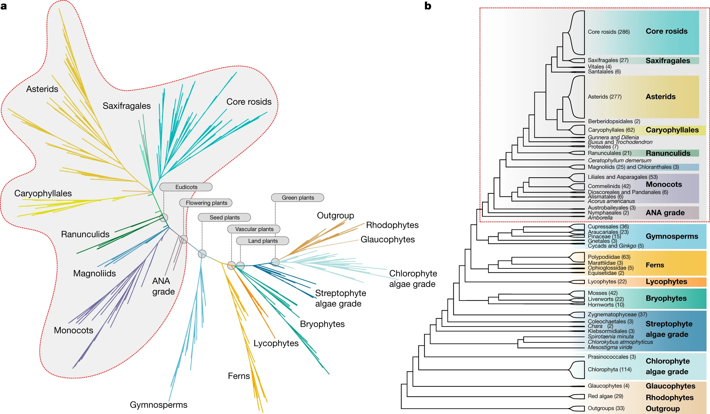

# Plants

<!-- TOC -->
* [Plants](#plants)
  * [Strain info](#strain-info)
    * [List all ranks](#list-all-ranks)
    * [Species with assemblies](#species-with-assemblies)
  * [Download all assemblies](#download-all-assemblies)
    * [Create assembly.tsv](#create-assemblytsv)
    * [Count before download](#count-before-download)
    * [Download and check](#download-and-check)
    * [Rsync to hpcc](#rsync-to-hpcc)
  * [BioSample](#biosample)
  * [Green plants, glaucophytes and red algae](#green-plants-glaucophytes-and-red-algae)
    * [ReRoot](#reroot)
  * [MinHash](#minhash)
    * [Condense branches in the minhash tree](#condense-branches-in-the-minhash-tree)
  * [Count valid species and strains](#count-valid-species-and-strains)
    * [For *genomic alignments*](#for-genomic-alignments)
    * [For *protein families*](#for-protein-families)
  * [Collect proteins](#collect-proteins)
  * [Phylogenetics with BUSCO](#phylogenetics-with-busco)
    * [Find corresponding representative proteins by `hmmsearch`](#find-corresponding-representative-proteins-by-hmmsearch)
    * [Domain related protein sequences](#domain-related-protein-sequences)
    * [Align and concat marker genes to create species tree](#align-and-concat-marker-genes-to-create-species-tree)
    * [Condense branches in the protein tree](#condense-branches-in-the-protein-tree)
<!-- TOC -->

## Strain info

* [Viridiplantae](https://www.ncbi.nlm.nih.gov/Taxonomy/Browser/wwwtax.cgi?id=33090)
* [Rhodophyta](https://www.ncbi.nlm.nih.gov/Taxonomy/Browser/wwwtax.cgi?id=2763)
* [Glaucophyta](https://www.ncbi.nlm.nih.gov/Taxonomy/Browser/wwwtax.cgi?id=38254)

### List all ranks

```shell
for phylum in Viridiplantae Rhodophyta Glaucophyta; do
    nwr member ${phylum} |
        grep -v " sp." |
        grep -v " x " |
        tsv-summarize -H -g rank --count |
        rgr md stdin --num
    echo
done

```

| rank          |  count |
|---------------|-------:|
| kingdom       |      1 |
| phylum        |      3 |
| class         |     38 |
| order         |    189 |
| family        |    924 |
| genus         |  17030 |
| no rank       |   5218 |
| species       | 186344 |
| strain        |     40 |
| subphylum     |      1 |
| subspecies    |   8152 |
| varietas      |   8590 |
| subclass      |     28 |
| clade         |    152 |
| forma         |    398 |
| subfamily     |    276 |
| suborder      |     24 |
| subgenus      |    163 |
| section       |    494 |
| tribe         |    856 |
| subtribe      |    469 |
| subsection    |     41 |
| morph         |      5 |
| series        |      4 |
| isolate       |      3 |
| genotype      |     14 |
| species group |      5 |
| superorder    |      2 |

| rank       | count |
|------------|------:|
| phylum     |     1 |
| genus      |   809 |
| no rank    |   451 |
| class      |     5 |
| order      |    43 |
| family     |   119 |
| species    |  3719 |
| subclass   |     5 |
| subspecies |     7 |
| varietas   |    30 |
| forma      |    13 |
| clade      |     2 |
| subfamily  |    14 |
| tribe      |     8 |
| strain     |     3 |

| rank    | count |
|---------|------:|
| class   |     1 |
| no rank |     2 |
| genus   |     4 |
| species |    15 |
| order   |     2 |
| family  |     3 |

### Species with assemblies

* 'RefSeq'
    * RS1 - genome_rep: 'Full'
* 'Genbank'
    * GB1 - genome_rep: 'Full'

```shell
mkdir -p ~/data/Plants/summary
cd ~/data/Plants/summary

# should have a valid name of genus
nwr member Viridiplantae Rhodophyta Glaucophyta -r genus |
    sed '1d' |
    sort -n -k1,1 \
    > genus.list.tsv

wc -l genus.list.tsv
#17873 genus.list

cat genus.list.tsv | cut -f 1 |
while read RANK_ID; do
    echo "
        SELECT
            species_id,
            species,
            COUNT(*) AS count
        FROM ar
        WHERE 1=1
            AND genus_id = ${RANK_ID}
            AND species NOT LIKE '% sp.%'
            AND species NOT LIKE '% x %'
            AND genome_rep IN ('Full')
        GROUP BY species_id
        HAVING count >= 1
        " |
        sqlite3 -tabs ~/.nwr/ar_refseq.sqlite
done |
    tsv-sort -k2,2 \
    > RS1.tsv

cat genus.list.tsv | cut -f 1 |
while read RANK_ID; do
    echo "
        SELECT
            species_id,
            species,
            COUNT(*) AS count
        FROM ar
        WHERE 1=1
            AND genus_id = ${RANK_ID}
            AND species NOT LIKE '% sp.%'
            AND species NOT LIKE '% x %'
            AND genome_rep IN ('Full')
        GROUP BY species_id
        HAVING count >= 1
        " |
        sqlite3 -tabs ~/.nwr/ar_genbank.sqlite
done |
    tsv-sort -k2,2 \
    > GB1.tsv

wc -l RS*.tsv GB*.tsv
#  182 RS1.tsv
# 2050 GB1.tsv

for C in RS GB; do
    for N in $(seq 1 1 10); do
        if [ -e "${C}${N}.tsv" ]; then
            printf "${C}${N}\t"
            cat ${C}${N}.tsv |
                tsv-summarize --sum 3
        fi
    done
done
#RS1     182
#GB1     4753

```

## Download all assemblies

### Create assembly.tsv

If a refseq assembly is available, the corresponding genbank one is not downloaded

```shell
cd ~/data/Plants/summary

# RS
SPECIES=$(
    cat RS1.tsv |
        cut -f 1 |
        tr "\n" "," |
        sed 's/,$//'
)

echo "
.header ON
    SELECT
        species || ' ' || infraspecific_name || ' ' || assembly_accession AS name,
        species, genus, ftp_path, biosample, assembly_level,
        assembly_accession
    FROM ar
    WHERE 1=1
        AND species_id IN ($SPECIES)
        AND species NOT LIKE '% sp.%'
        AND species NOT LIKE '% x %'
        AND genome_rep IN ('Full')
    " |
    sqlite3 -tabs ~/.nwr/ar_refseq.sqlite \
    > raw.tsv

# Preference for refseq
cat raw.tsv |
    tsv-select -H -f "assembly_accession" \
    > rs.acc.tsv

# GB
SPECIES=$(
    cat GB1.tsv |
        cut -f 1 |
        tr "\n" "," |
        sed 's/,$//'
)

echo "
    SELECT
        species || ' ' || infraspecific_name || ' ' || assembly_accession AS name,
        species, genus, ftp_path, biosample, assembly_level,
        gbrs_paired_asm
    FROM ar
    WHERE 1=1
        AND species_id IN ($SPECIES)
        AND species NOT LIKE '% sp.%'
        AND species NOT LIKE '% x %'
        AND genome_rep IN ('Full')
    " |
    sqlite3 -tabs ~/.nwr/ar_genbank.sqlite |
    tsv-join -f rs.acc.tsv -k 1 -d 7 -e \
    >> raw.tsv

cat raw.tsv |
    rgr dedup stdin |
    datamash check
#4764 lines, 7 fields

# Create abbr.
cat raw.tsv |
    grep -v '^#' |
    rgr dedup stdin |
    tsv-select -f 1-6 |
    perl ~/Scripts/genomes/bin/abbr_name.pl -c "1,2,3" -s '\t' -m 3 --shortsub |
    (echo -e '#name\tftp_path\tbiosample\tspecies\tassembly_level' && cat ) |
    perl -nl -a -F"," -e '
        BEGIN{my %seen};
        /^#/ and print and next;
        /^organism_name/i and next;
        $seen{$F[3]}++; # ftp_path
        $seen{$F[3]} > 1 and next;
        $seen{$F[6]}++; # abbr_name
        $seen{$F[6]} > 1 and next;
        printf qq{%s\t%s\t%s\t%s\t%s\n}, $F[6], $F[3], $F[4], $F[1], $F[5];
        ' |
    tsv-filter --or --str-in-fld 2:ftp --str-in-fld 2:http |
    keep-header -- tsv-sort -k4,4 -k1,1 \
    > Plants.assembly.tsv

datamash check < Plants.assembly.tsv
#4466 lines, 5 fields

# find potential duplicate strains or assemblies
cat Plants.assembly.tsv |
    tsv-uniq -f 1 --repeated

cat Plants.assembly.tsv |
    tsv-filter --str-not-in-fld 2:ftp

# Edit .assembly.tsv, remove unnecessary strains, check strain names and comment out poor assemblies.
# vim Plants.assembly.tsv
#
# Save the file to another directory to prevent accidentally changing it
# cp Plants.assembly.tsv ~/Scripts/genomes/assembly

# Cleaning
rm raw*.*sv

```

### Count before download

* `strains.taxon.tsv` - taxonomy info: species, genus, family, order, and class

```shell
cd ~/data/Plants

nwr template ~/Scripts/genomes/assembly/Plants.assembly.tsv \
    --count \
    --rank genus

# strains.taxon.tsv and taxa.tsv
bash Count/strains.sh

cat Count/taxa.tsv |
    rgr md stdin --num

# genus.lst and genus.count.tsv
bash Count/rank.sh

mv Count/genus.count.tsv Count/genus.before.tsv

cat Count/genus.before.tsv |
    keep-header -- tsv-sort -k1,1 |
    tsv-filter -H --ge 3:20 |
    rgr md stdin --num

```

| item    | count |
|---------|------:|
| strain  |  4464 |
| species |  2027 |
| genus   |   988 |
| family  |   292 |
| order   |   113 |
| class   |    32 |

| genus        | #species | #strains |
|--------------|---------:|---------:|
| Arabidopsis  |        5 |      158 |
| Arachis      |        6 |       27 |
| Bathycoccus  |        2 |       23 |
| Beta         |        5 |      127 |
| Brassica     |        9 |       71 |
| Capsicum     |        5 |       31 |
| Carex        |       14 |       22 |
| Chlorella    |        5 |       22 |
| Citrullus    |        7 |       35 |
| Citrus       |       15 |       48 |
| Cucumis      |        5 |       53 |
| Erythroxylum |       62 |       63 |
| Eucalyptus   |       34 |       41 |
| Fraxinus     |       23 |       31 |
| Glycine      |        4 |       29 |
| Gossypium    |       29 |       61 |
| Hordeum      |        4 |      189 |
| Juglans      |        9 |       22 |
| Linum        |        5 |       27 |
| Malus        |       11 |       61 |
| Micromonas   |        2 |       31 |
| Nicotiana    |       13 |       20 |
| Oryza        |       14 |      160 |
| Panicum      |        3 |       40 |
| Populus      |       11 |       22 |
| Prunus       |       17 |       47 |
| Quercus      |       21 |       34 |
| Raphanus     |        2 |       20 |
| Salix        |       11 |       27 |
| Solanum      |       54 |      198 |
| Sorghum      |        1 |       21 |
| Trifolium    |        9 |       25 |
| Triticum     |        6 |       45 |
| Vigna        |        9 |       31 |
| Vitis        |        7 |       39 |
| Zea          |        2 |      116 |

### Download and check

```shell
cd ~/data/Plants

ulimit -n `ulimit -Hn`

# Rsync running in 4 threads
nwr template ~/Scripts/genomes/assembly/Plants.assembly.tsv \
    --ass \
    --parallel 8

# Run
bash ASSEMBLY/rsync.sh

# Check md5; create check.lst
# More than 1 thread can affect the performance on HDD
nwr template ~/Scripts/genomes/assembly/Plants.assembly.tsv \
    --ass \
    --parallel 1
# rm ASSEMBLY/check.lst
bash ASSEMBLY/check.sh

# Put the misplaced directory into the right place
#bash ASSEMBLY/reorder.sh
#
# This operation will delete some files in the directory, so please be careful
#cat ASSEMBLY/remove.lst |
#    parallel --no-run-if-empty --linebuffer -k -j 1 '
#        if [[ -e "ASSEMBLY/{}" ]]; then
#            echo Remove {}
#            rm -fr "ASSEMBLY/{}"
#        fi
#    '

# N50 C S; create n50.tsv and n50.pass.tsv
bash ASSEMBLY/n50.sh 10000 300000 10000000

# Adjust parameters passed to `n50.sh`
cat ASSEMBLY/n50.tsv |
    tsv-filter -H --str-in-fld "name:_GCF_" |
    tsv-summarize -H --min "N50,S" --max "C"
#N50_min S_min   C_max
#15659   13032761        286090

cat ASSEMBLY/n50.tsv |
    tsv-summarize -H --quantile "S:0.1,0.5" --quantile "N50:0.1,0.5"  --quantile "C:0.5,0.9"
#S_pct10 S_pct50 N50_pct10       N50_pct50       C_pct50 C_pct90
#120099787.7     572934245       6209.3  23027706        914     230853.1

# After the above steps are completed, run the following commands.

# Collect; create collect.tsv
bash ASSEMBLY/collect.sh

# After all completed
bash ASSEMBLY/finish.sh

cp ASSEMBLY/collect.pass.tsv summary/

cat ASSEMBLY/counts.tsv |
    rgr md stdin --right 2-3

```

| #item            | fields | lines |
|------------------|-------:|------:|
| url.tsv          |      3 | 4,464 |
| check.lst        |      1 | 4,463 |
| collect.tsv      |     20 | 4,464 |
| n50.tsv          |      4 | 4,465 |
| n50.pass.tsv     |      4 | 3,696 |
| collect.pass.tsv |     23 | 3,696 |
| pass.lst         |      1 | 3,695 |
| omit.lst         |      1 | 3,827 |
| rep.lst          |      1 | 1,632 |
| sp.lst           |      0 |     0 |

### Rsync to hpcc

```shell
rsync -avP \
    ~/data/Plants/ \
    wangq@202.119.37.251:data/Plants

# rsync -avP wangq@202.119.37.251:data/Plants/ ~/data/Plants

```

## BioSample

```shell
cd ~/data/Plants

ulimit -n `ulimit -Hn`

nwr template ~/Scripts/genomes/assembly/Plants.assembly.tsv \
    --bs

# Run this script twice and it will re-download the failed files
bash BioSample/download.sh

# Ignore rare attributes
bash BioSample/collect.sh 10

datamash check < BioSample/biosample.tsv
#4019 lines, 158 fields

cp BioSample/attributes.lst summary/
cp BioSample/biosample.tsv summary/

```

## Green plants, glaucophytes and red algae



### ReRoot

https://doi.org/10.1073/pnas.91.15.7281

The only Glaucophyta assembly Cyano_parad_GCA_004431415_1 has no protein annotation

```shell
cd ~/data/Plants

cat summary/collect.pass.tsv |
    tsv-select -f 1,3 |
    sed '1d' |
    grep -v -Fw -f ASSEMBLY/omit.lst |
    nwr append stdin -c 2 -r species -r phylum |
    tsv-filter --or \
        --str-eq "4:Rhodophyta" \
        --str-eq "4:Glaucophyta" \
        --str-eq "4:NA" |
    tsv-select -f 1,3,4 |
    tsv-sort -k3,3 -k1,1 |
    tsv-summarize -g 3,2 --count
#Rhodophyta      Chondrus crispus        1
#Rhodophyta      Cyanidiococcus yangmingshanensis        2
#Rhodophyta      Cyanidioschyzon merolae 2
#Rhodophyta      Galdieria partita       1
#Rhodophyta      Galdieria sulphuraria   2
#Rhodophyta      Galdieria yellowstonensis       1
#Rhodophyta      Gracilaria domingensis  1
#Rhodophyta      Gracilariopsis chorda   1
#Rhodophyta      Neopyropia yezoensis    1
#Rhodophyta      Porphyra umbilicalis    1
#Rhodophyta      Porphyridium purpureum  1
#Rhodophyta      Pyropia vietnamensis    1
#Rhodophyta      Rhodosorus marinus      1

cat summary/collect.pass.tsv |
    tsv-filter -H --not-blank RefSeq_category |
    tsv-filter -H --or \
        --str-in-fld "2:Chondrus" \
        --str-in-fld "2:Cyanidiococcus" \
        --str-in-fld "2:Cyanidioschyzon" \
        --str-in-fld "2:Galdieria" \
        --str-in-fld "2:Gracilaria" \
        --str-in-fld "2:Gracilariopsis" \
        --str-in-fld "2:Neopyropia" \
        --str-in-fld "2:Porphyra" \
        --str-in-fld "2:Porphyridium" \
        --str-in-fld "2:Pyropia" \
        --str-in-fld "2:Rhodosorus" |
    grep -v -Fw -f ASSEMBLY/omit.lst |
    tsv-select -H -f "#name,Assembly_level,Assembly_method,Genome_coverage,Sequencing_technology"
##name   Assembly_level  Assembly_method Genome_coverage Sequencing_technology
#Chondrus_crispus_Stackhouse_GCF_000350225_1     Scaffold
#Cyanidioc_yangm_THAL066_GCA_013995675_1 Contig  HGAP v. 4       252.0x  PacBio Sequel
#Cyanidios_mero_10D_GCF_000091205_1      Complete Genome
#Gald_parti_NBRC_102759_GCA_025991245_1  Contig  Canu v. 2.0     800x    PacBio Sequel
#Gald_sul_074W_GCF_000341285_1   Scaffold        Arachne v. 3.0  8x Sanger       Sanger
#Gald_yel_108_79_E11_GCA_026122205_1     Contig  FALCON v. 0.3.0 285x    PacBio Sequel
#Gracilaria_domingensis_GCA_022539475_1  Scaffold        miniasm v. 0.2  180.0x  PacBio RSII
#Gracilario_chorda_GCA_003194525_1       Contig  SMRTmake v. MAY-2015    88.0x   PacBio
#Neopy_yez_RZ_GCA_009829735_1    Chromosome      HGAP v. RS_HGAP_Assembly.3      100.0x  Illumina HiSeq
#Porphyra_umbi_GCA_002049455_2   Scaffold        FALCON v. 2.0   432x    PACBIO
#Porphyri_purpureum_GCA_008690995_1      Contig  MaSuRCA v. 3.2.8        45.0x   Oxford Nanopore MinION
#Pyro_vie_GCA_042855435_1        Contig  NECAT v. 0.0.1  30x     MinION
#Rhodos_marinus_CCMP1338_GCA_029953675_1 Contig  NextDenovo v. 2.5.0     340.0x  Oxford Nanopore GridION

```

## MinHash

```shell
cd ~/data/Plants

nwr template ~/Scripts/genomes/assembly/Plants.assembly.tsv \
    --mh \
    --parallel 1 \
    --in ASSEMBLY/pass.lst \
    --ani-ab 0.05 \
    --ani-nr 0.005

# Compute assembly sketches
bash MinHash/compute.sh

# Non-redundant strains within species
bash MinHash/nr.sh

find MinHash -name "NR.lst" |
    xargs cat |
    sort |
    uniq \
    > summary/NR.lst
find MinHash -name "redundant.lst" |
    xargs cat |
    sort |
    uniq \
    > summary/redundant.lst

wc -l summary/NR.lst summary/redundant.lst
# 1858 summary/NR.lst
#  794 summary/redundant.lst

# Abnormal strains
bash MinHash/abnormal.sh

cat MinHash/abnormal.lst | wc -l
#38

# Distances between all selected sketches, then hierarchical clustering
cd ~/data/Plants/

nwr template ~/Scripts/genomes/assembly/Plants.assembly.tsv \
    --mh \
    --parallel 8 \
    --not-in MinHash/abnormal.lst \
    --not-in summary/redundant.lst \
    --height 0.4

bash MinHash/dist.sh

```

### Condense branches in the minhash tree

```shell
mkdir -p ~/data/Plants/tree
cd ~/data/Plants/tree

nw_reroot ../MinHash/tree.nwk Cyanidios_mero_10D_GCF_000091205_1 Gald_parti_NBRC_102759_GCA_025991245_1 |
    nwr order stdin --nd --an \
    > minhash.reroot.newick

nwr pl-condense --map -r order -r family -r genus \
    minhash.reroot.newick ../MinHash/species.tsv |
    nwr order stdin --nd --an \
    -o minhash.condensed.newick

mv condensed.tsv minhash.condensed.tsv

# svg
nwr topo --bl minhash.condensed.newick | # remove comments
    nw_display -s -b 'visibility:hidden' -w 1200 -v 20 - \
    > Plants.minhash.svg

```

## Count valid species and strains

### For *genomic alignments*

```shell
cd ~/data/Plants/

nwr template ~/Scripts/genomes/assembly/Plants.assembly.tsv \
    --count \
    --in ASSEMBLY/pass.lst \
    --not-in MinHash/abnormal.lst \
    --rank order --rank genus \
    --lineage family --lineage genus

# strains.taxon.tsv and taxa.tsv
bash Count/strains.sh

cat Count/taxa.tsv |
    rgr md stdin --num

# .lst and .count.tsv
bash Count/rank.sh

cat Count/order.count.tsv |
    tsv-filter -H --ge "3:50" |
    rgr md stdin --num

cat Count/genus.count.tsv |
    tsv-filter -H --ge "3:50" |
    rgr md stdin --num

# Can accept N_COUNT
bash Count/lineage.sh 10

cat Count/lineage.count.tsv |
    rgr md stdin --num

# copy to summary/
cp Count/strains.taxon.tsv summary/genome.taxon.tsv

```

| item    | count |
|---------|------:|
| strain  |  3657 |
| species |  1653 |
| genus   |   838 |
| family  |   262 |
| order   |   105 |
| class   |    32 |

| order          | #species | #strains |
|----------------|---------:|---------:|
| Asterales      |       63 |      107 |
| Brassicales    |       91 |      353 |
| Caryophyllales |       62 |      164 |
| Cucurbitales   |       37 |      125 |
| Ericales       |       49 |       83 |
| Fabales        |      128 |      275 |
| Fagales        |       59 |      108 |
| Lamiales       |      102 |      146 |
| Malpighiales   |      107 |      187 |
| Malvales       |       49 |      107 |
| Myrtales       |       70 |       93 |
| Poales         |      165 |      625 |
| Rosales        |       96 |      240 |
| Sapindales     |       53 |      102 |
| Solanales      |       85 |      238 |

| genus       | #species | #strains |
|-------------|---------:|---------:|
| Arabidopsis |        5 |      154 |
| Beta        |        4 |       71 |
| Brassica    |        9 |       71 |
| Cucumis     |        5 |       52 |
| Gossypium   |       20 |       51 |
| Hordeum     |        3 |      117 |
| Malus       |       11 |       61 |
| Oryza       |       14 |      100 |
| Solanum     |       48 |      162 |
| Zea         |        2 |       93 |

| #family        | genus       | species                  | count |
|----------------|-------------|--------------------------|------:|
| Asteraceae     | Helianthus  | Helianthus annuus        |    11 |
| Brassicaceae   | Arabidopsis | Arabidopsis thaliana     |   141 |
|                | Brassica    | Brassica napus           |    15 |
|                |             | Brassica oleracea        |    28 |
|                | Raphanus    | Raphanus sativus         |    16 |
| Cannabaceae    | Cannabis    | Cannabis sativa          |    10 |
| Chenopodiaceae | Beta        | Beta vulgaris            |    68 |
|                | Chenopodium | Chenopodium quinoa       |    11 |
| Cucurbitaceae  | Citrullus   | Citrullus lanatus        |    15 |
|                | Cucumis     | Cucumis melo             |    36 |
|                |             | Cucumis sativus          |    13 |
| Fabaceae       | Arachis     | Arachis hypogaea         |    14 |
|                | Glycine     | Glycine max              |    22 |
|                | Lupinus     | Lupinus angustifolius    |    11 |
|                | Phaseolus   | Phaseolus vulgaris       |    10 |
| Linaceae       | Linum       | Linum tenue              |    19 |
| Malvaceae      | Gossypium   | Gossypium hirsutum       |    14 |
|                | Theobroma   | Theobroma cacao          |    11 |
| Mamiellaceae   | Micromonas  | Micromonas commoda       |    10 |
| Poaceae        | Cenchrus    | Cenchrus americanus      |    12 |
|                | Hordeum     | Hordeum vulgare          |   111 |
|                | Oryza       | Oryza sativa             |    74 |
|                | Panicum     | Panicum miliaceum        |    37 |
|                | Sorghum     | Sorghum bicolor          |    20 |
|                | Triticum    | Triticum aestivum        |    24 |
|                | Zea         | Zea mays                 |    92 |
| Rhamnaceae     | Ziziphus    | Ziziphus jujuba          |    10 |
| Rosaceae       | Malus       | Malus domestica          |    30 |
| Rutaceae       | Citrus      | Citrus sinensis          |    16 |
| Solanaceae     | Capsicum    | Capsicum annuum          |    24 |
|                | Solanum     | Solanum lycopersicum     |    31 |
|                |             | Solanum pimpinellifolium |    10 |
|                |             | Solanum tuberosum        |    29 |
|                |             | Solanum verrucosum       |    18 |
| Theaceae       | Camellia    | Camellia sinensis        |    11 |
| Vitaceae       | Vitis       | Vitis vinifera           |    29 |

### For *protein families*

```shell
cd ~/data/Plants/

nwr template ~/Scripts/genomes/assembly/Plants.assembly.tsv \
    --count \
    --in ASSEMBLY/pass.lst \
    --not-in MinHash/abnormal.lst \
    --not-in ASSEMBLY/omit.lst \
    --rank genus

# strains.taxon.tsv and taxa.tsv
bash Count/strains.sh

cat Count/taxa.tsv |
    rgr md stdin --num

# .lst and .count.tsv
bash Count/rank.sh

cat Count/genus.count.tsv |
    tsv-filter -H --ge "3:10" |
    rgr md stdin --num

# copy to summary/
cp Count/strains.taxon.tsv summary/protein.taxon.tsv

```

| item    | count |
|---------|------:|
| strain  |   612 |
| species |   460 |
| genus   |   284 |
| family  |   127 |
| order   |    67 |
| class   |    19 |

| genus       | #species | #strains |
|-------------|---------:|---------:|
| Arabidopsis |        5 |       10 |
| Brassica    |        5 |       15 |
| Glycine     |        2 |       10 |
| Gossypium   |       11 |       18 |
| Oryza       |        4 |       10 |
| Prunus      |        8 |       14 |
| Salix       |        7 |       10 |
| Solanum     |       10 |       15 |

## Collect proteins

```shell
cd ~/data/Plants/

nwr template ~/Scripts/genomes/assembly/Plants.assembly.tsv \
    --pro \
    --parallel 8 \
    --in ASSEMBLY/pass.lst \
    --not-in ASSEMBLY/omit.lst

# collect proteins and
bash Protein/collect.sh

# clustering
# It may need to be run several times
bash Protein/cluster.sh

rm -fr Protein/tmp/

# info.tsv
bash Protein/info.sh

# counts
bash Protein/count.sh

cat Protein/counts.tsv |
    tsv-summarize -H --count --sum 2-7 |
    sed 's/^count/species/' |
    datamash transpose |
    perl -nla -F"\t" -MNumber::Format -e '
        printf qq(%s\t%s\n), $F[0], Number::Format::format_number($F[1], 0,);
        ' |
    (echo -e "#item\tcount" && cat) |
    rgr md stdin -r 2

```

| #item      |      count |
|------------|-----------:|
| species    |        461 |
| strain_sum |        616 |
| total_sum  | 25,753,399 |
| dedup_sum  | 25,733,160 |
| rep_sum    | 17,995,862 |
| fam88_sum  | 14,391,956 |
| fam38_sum  |  9,774,398 |

## Phylogenetics with BUSCO

```shell
cd ~/data/Plants/

rm -fr BUSCO

curl -L https://busco-data.ezlab.org/v5/data/lineages/viridiplantae_odb10.2024-01-08.tar.gz |
    tar xvz

mv viridiplantae_odb10/ BUSCO

```

### Find corresponding representative proteins by `hmmsearch`

```shell
cd ~/data/Plants

cat Protein/species.tsv |
    tsv-join -f ASSEMBLY/pass.lst -k 1 |
    tsv-join -e -f ASSEMBLY/omit.lst -k 1 \
    > Protein/species-f.tsv

cat Protein/species-f.tsv |
    tsv-select -f 2 |
    rgr dedup stdin |
while read SPECIES; do
    if [[ -s Protein/"${SPECIES}"/busco.tsv ]]; then
        continue
    fi
    if [[ ! -f Protein/"${SPECIES}"/rep_seq.fa.gz ]]; then
        continue
    fi

    echo >&2 "${SPECIES}"

    cat BUSCO/scores_cutoff |
        parallel --colsep '\s+' --no-run-if-empty --linebuffer -k -j 4 "
            gzip -dcf Protein/${SPECIES}/rep_seq.fa.gz |
                hmmsearch -T {2} --domT {2} --noali --notextw BUSCO/hmms/{1}.hmm - |
                grep '>>' |
                perl -nl -e ' m(>>\s+(\S+)) and printf qq(%s\t%s\n), q({1}), \$1; '
        " \
        > Protein/${SPECIES}/busco.tsv
done

fd --full-path "Protein/.+/busco.tsv" -X cat |
    tsv-summarize --group-by 1 --count |
    tsv-summarize --quantile 2:0.25,0.5,0.75
#594     651     738

# There are 461 species and 616 strains
fd --full-path "Protein/.+/busco.tsv" -X cat |
    tsv-summarize --group-by 1 --count |
    tsv-filter --invert --ge 2:450 --le 2:650 |
    cut -f 1 \
    > Protein/marker.omit.lst

cat BUSCO/scores_cutoff |
    parallel --colsep '\s+' --no-run-if-empty --linebuffer -k -j 1 "
        echo {1}
    " \
    > Protein/marker.lst

wc -l Protein/marker.lst Protein/marker.omit.lst
# 425 Protein/marker.lst
# 216 Protein/marker.omit.lst

cat Protein/species-f.tsv |
    tsv-select -f 2 |
    rgr dedup stdin |
while read SPECIES; do
    if [[ ! -s Protein/"${SPECIES}"/busco.tsv ]]; then
        continue
    fi
    if [[ ! -f Protein/"${SPECIES}"/seq.sqlite ]]; then
        continue
    fi

    echo >&2 "${SPECIES}"

    # single copy
    cat Protein/"${SPECIES}"/busco.tsv |
        grep -v -Fw -f Protein/marker.omit.lst \
        > Protein/"${SPECIES}"/busco.sc.tsv

    nwr seqdb -d Protein/${SPECIES} --rep f3=Protein/${SPECIES}/busco.sc.tsv

done

```

### Domain related protein sequences

```shell
cd ~/data/Plants

mkdir -p Domain

# each assembly
cat Protein/species-f.tsv |
    tsv-select -f 2 |
    rgr dedup stdin |
while read SPECIES; do
    if [[ ! -f Protein/"${SPECIES}"/seq.sqlite ]]; then
        continue
    fi

    echo >&2 "${SPECIES}"

    echo "
        SELECT
            seq.name,
            asm.name,
            rep.f3
        FROM asm_seq
        JOIN rep_seq ON asm_seq.seq_id = rep_seq.seq_id
        JOIN seq ON asm_seq.seq_id = seq.id
        JOIN rep ON rep_seq.rep_id = rep.id
        JOIN asm ON asm_seq.asm_id = asm.id
        WHERE 1=1
            AND rep.f3 IS NOT NULL
        ORDER BY
            asm.name,
            rep.f3
        " |
        sqlite3 -tabs Protein/${SPECIES}/seq.sqlite \
        > Protein/${SPECIES}/seq_asm_f3.tsv

    hnsm some Protein/"${SPECIES}"/pro.fa.gz <(
            tsv-select -f 1 Protein/"${SPECIES}"/seq_asm_f3.tsv |
                rgr dedup stdin
        )
done |
    hnsm dedup stdin |
    hnsm gz stdin -o Domain/busco.fa

fd --full-path "Protein/.+/seq_asm_f3.tsv" -X cat \
    > Domain/seq_asm_f3.tsv

cat Domain/seq_asm_f3.tsv |
    tsv-join -e -d 2 -f summary/redundant.lst -k 1 \
    > Domain/seq_asm_f3.NR.tsv

```

### Align and concat marker genes to create species tree

```shell
cd ~/data/Plants

# Extract proteins
cat Protein/marker.lst |
    grep -v -Fw -f Protein/marker.omit.lst |
    parallel --no-run-if-empty --linebuffer -k -j 4 '
        echo >&2 "==> marker [{}]"

        mkdir -p Domain/{}

        hnsm some Domain/busco.fa.gz <(
            cat Domain/seq_asm_f3.tsv |
                tsv-filter --str-eq "3:{}" |
                tsv-select -f 1 |
                rgr dedup stdin
            ) \
            > Domain/{}/{}.pro.fa
    '

# Align each marker
cat Protein/marker.lst |
    grep -v -Fw -f Protein/marker.omit.lst |
    parallel --no-run-if-empty --linebuffer -k -j 4 '
        echo >&2 "==> marker [{}]"
        if [ ! -s Domain/{}/{}.pro.fa ]; then
            exit
        fi
        if [ -s Domain/{}/{}.aln.fa ]; then
            exit
        fi

#        muscle -quiet -in Domain/{}/{}.pro.fa -out Domain/{}/{}.aln.fa
        mafft --auto Domain/{}/{}.pro.fa > Domain/{}/{}.aln.fa
    '

cat Protein/marker.lst |
    grep -v -Fw -f Protein/marker.omit.lst |
while read marker; do
    echo >&2 "==> marker [${marker}]"
    if [ ! -s Domain/${marker}/${marker}.pro.fa ]; then
        continue
    fi

    # sometimes `muscle` can not produce alignments
    if [ ! -s Domain/${marker}/${marker}.aln.fa ]; then
        continue
    fi

    # Only NR strains
    # 1 name to many names
    cat Domain/seq_asm_f3.NR.tsv |
        tsv-filter --str-eq "3:${marker}" |
        tsv-select -f 1-2 |
        hnsm replace -s Domain/${marker}/${marker}.aln.fa stdin \
        > Domain/${marker}/${marker}.replace.fa
done

# Concat marker genes
cat Protein/marker.lst |
    grep -v -Fw -f Protein/marker.omit.lst |
while read marker; do
    if [ ! -s Domain/${marker}/${marker}.pro.fa ]; then
        continue
    fi
    if [ ! -s Domain/${marker}/${marker}.aln.fa ]; then
        continue
    fi

    cat Domain/${marker}/${marker}.replace.fa

    # empty line for .fas
    echo
done \
    > Domain/busco.aln.fas

cat Domain/seq_asm_f3.NR.tsv |
    cut -f 2 |
    rgr dedup stdin |
    sort |
    fasops concat Domain/busco.aln.fas stdin -o Domain/busco.aln.fa

trimal -in Domain/busco.aln.fa -out Domain/busco.trim.fa -automated1

hnsm size Domain/busco.*.fa |
    rgr dedup stdin -f 2 |
    cut -f 2
#1343280
#56355

# To make it faster
FastTree -fastest -noml Domain/busco.trim.fa > Domain/busco.trim.newick

```

### Condense branches in the protein tree

```shell
cd ~/data/Plants/tree

nw_reroot  ../Domain/busco.trim.newick Cyanidios_mero_10D_GCF_000091205_1 Gald_parti_NBRC_102759_GCA_025991245_1 |
    nwr order stdin --nd --an \
    > busco.reroot.newick

nwr pl-condense --map -r order -r family -r genus \
    busco.reroot.newick ../Count/species.tsv |
    nwr order stdin --nd --an \
    -o busco.condensed.newick

mv condensed.tsv busco.condense.tsv

# svg
nwr topo --bl busco.condensed.newick | # remove comments
    nw_display -s -b 'visibility:hidden' -w 1200 -v 20 - \
    > Plants.busco.svg

```

