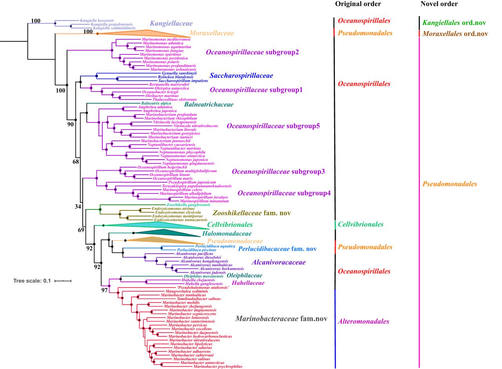

# *Pseudomonas* HGT

<!-- toc -->

- [Strain info](#strain-info)
    * [Symlink](#symlink)
    * [List all ranks](#list-all-ranks)
    * [Species with assemblies](#species-with-assemblies)
- [All assemblies](#all-assemblies)
    * [List strains of the target genus and remove abnormal strains](#list-strains-of-the-target-genus-and-remove-abnormal-strains)
    * [Extract from `../Bacteria`](#extract-from-bacteria)
    * [Count strains - Genus](#count-strains---genus)
    * [Typical strains](#typical-strains)
    * [Rsync to hpcc](#rsync-to-hpcc)
- [NCBI taxonomy](#ncbi-taxonomy)
- [Collect proteins](#collect-proteins)
    * [`all.pro.fa`](#allprofa)
    * [`all.replace.fa`](#allreplacefa)
    * [`all.info.tsv`](#allinfotsv)
- [Phylogenetics with bac120](#phylogenetics-with-bac120)
    * [Find corresponding proteins by `hmmsearch`](#find-corresponding-proteins-by-hmmsearch)
    * [Align and concat marker genes to create species tree](#align-and-concat-marker-genes-to-create-species-tree)
    * [Tweak the concat tree](#tweak-the-concat-tree)
- [InterProScan on all proteins of representative and typical strains](#interproscan-on-all-proteins-of-representative-and-typical-strains)
- [Count members of protein families](#count-members-of-protein-families)
    * [Pseudomonas](#pseudomonas)
    * [P. aeruginosa](#p-aeruginosa)
    * [P. putida](#p-putida)
    * [Acinetobacter](#acinetobacter)
    * [A. baumannii](#a-baumannii)
- [Protein families](#protein-families)
    * [IPR007416 - YggL 50S ribosome-binding protein](#ipr007416---yggl-50s-ribosome-binding-protein)

<!-- tocstop -->

## Strain info

* [Pseudomonas](https://www.ncbi.nlm.nih.gov/Taxonomy/Browser/wwwtax.cgi?id=286)
* [Acinetobacter](https://www.ncbi.nlm.nih.gov/Taxonomy/Browser/wwwtax.cgi?id=469)

According to a recent [paper](https://doi.org/10.1128/mSystems.00543-20), there are some order-level
changes in Gammaproteobacteria. We include both old and new orders.

* Old ones: Cellvibrionales, Oceanospirillales, Pseudomonadales, and Alteromonadales
* New ones: Moraxellales, Kangiellales, and Pseudomonadales



Another recent [paper](https://doi.org/10.1099/ijsem.0.005542) proposed that an outlier clade of P.
aeruginosa (containing PA7) split into a new species, Pseudomonas paraeruginosa.

Similarly, a recent [paper](https://doi.org/10.1016/j.syapm.2021.126289) suggested that some species
of Pseudomonas should be transferred to Halopseudomonas and Stutzerimonas.

Also, Azotobacter is actually inside other Pseudomonas.

### Symlink

```shell
mkdir -p ~/data/Pseudomonas
cd ~/data/Pseudomonas

rm -fr ASSEMBLY
rm -fr NR
rm -fr STRAINS

ln -s ../Bacteria/ASSEMBLY ASSEMBLY
ln -s ../Bacteria/NR NR
ln -s ../Bacteria/STRAINS STRAINS

```

### List all ranks

```shell
mkdir -p ~/data/Pseudomonas
cd ~/data/Pseudomonas

nwr member Pseudomonas Acinetobacter Stenotrophomonas Serratia Burkholderia Bordetella |
    grep -v " sp." |
    tsv-summarize -H -g 3 --count |
    mlr --itsv --omd cat

nwr member Pseudomonas Acinetobacter Stenotrophomonas Burkholderia Bordetella -r "species group" -r "species subgroup" |
    tsv-select -f 1-3 |
    keep-header -- tsv-sort -k3,3 -k2,2 |
    sed 's/Pseudomonas /P. /g' |
    sed 's/Acinetobacter /A. /g' |
    sed 's/Stenotrophomonas /St. /g' |
    sed 's/Serratia /Se. /g' |
    sed 's/Burkholderia /Bu. /g' |
    sed 's/Bordetella /Bo. /g' |
    mlr --itsv --omd cat

```

| rank             | count |
|------------------|-------|
| genus            | 6     |
| species          | 686   |
| strain           | 2380  |
| subspecies       | 16    |
| no rank          | 142   |
| species group    | 10    |
| species subgroup | 7     |
| isolate          | 6     |

| #tax_id | sci_name                                 | rank             |
|---------|------------------------------------------|------------------|
| 2839056 | A. Taxon 24                              | species group    |
| 909768  | A. calcoaceticus/baumannii complex       | species group    |
| 87882   | Bu. cepacia complex                      | species group    |
| 136841  | P. aeruginosa group                      | species group    |
| 136842  | P. chlororaphis group                    | species group    |
| 136843  | P. fluorescens group                     | species group    |
| 136845  | P. putida group                          | species group    |
| 136849  | P. syringae group                        | species group    |
| 995085  | St. maltophilia group                    | species group    |
| 111527  | pseudomallei group                       | species group    |
| 2839060 | A. Taxon 24C                             | species subgroup |
| 2839057 | A. Taxon 24D                             | species subgroup |
| 2839061 | A. Taxon 24E                             | species subgroup |
| 627141  | P. nitroreducens/multiresinivorans group | species subgroup |
| 1232139 | P. oleovorans/pseudoalcaligenes group    | species subgroup |
| 251695  | P. syringae group genomosp. 1            | species subgroup |
| 251698  | P. syringae group genomosp. 2            | species subgroup |

### Species with assemblies

* Order Pseudomonadales and Moraxellales
    * Old ones: Cellvibrionales, Oceanospirillales, Pseudomonadales, and Alteromonadales
    * New ones: Moraxellales, Kangiellales, and Pseudomonadales
    * Pseudomonas aeruginosa
    * Acinetobacter baumannii

* Order Xanthomonadales
    * Stenotrophomonas maltophilia

* Order Enterobacterales
    * Serratia marcescens

* Order Burkholderiales: It is classified as Betaproteobacteria, but is close Gammaproteobacteria
    * Burkholderia cepacia
    * Bordetella pertussis

* Order Legionellales
    * Coxiella burnetii

* Order Enterobacterales
    * Escherichia coli
    * Klebsiella pneumoniae
    * Salmonella enterica
    * Shigella flexneri

```shell
mkdir -p ~/data/Pseudomonas/summary
cd ~/data/Pseudomonas/summary

SPECIES=$(
    nwr member \
        Cellvibrionales Oceanospirillales Alteromonadales \
        Moraxellales Kangiellales Pseudomonadales \
        Xanthomonadales \
        Burkholderiales \
        Serratia \
        -r species |
        grep -v -i "Candidatus " |
        grep -v -i "candidate " |
        grep -v " sp." |
        grep -v -E "\bbacterium\b" |
        grep -v -E "symbiont\b" |
        sed '1d' |
        cut -f 1 |
        sort |
        uniq
)

for S in $SPECIES; do
    RS=$(
        echo "
            SELECT
                COUNT(*)
            FROM ar
            WHERE 1=1
                AND species_id = $S
            " |
            sqlite3 -tabs ~/.nwr/ar_refseq.sqlite
    )

    CHR=$(
        echo "
            SELECT
                COUNT(*)
            FROM ar
            WHERE 1=1
                AND species_id = $S
                AND assembly_level IN ('Complete Genome', 'Chromosome')
            " |
            sqlite3 -tabs ~/.nwr/ar_refseq.sqlite
    )

    if [[ ${RS} -gt 0 ]]; then
        echo -e "$S\t$RS\t$CHR"
    fi
done |
    nwr append stdin |
    tsv-select -f 1,4,2-3 |
    tsv-sort -k3,3nr -k4,4nr -k2,2 |
    (echo -e 'species_id\tspecies\tRS\tCHR' && cat) \
    > species.count.tsv

cat species.count.tsv |
    tsv-filter -H --ge CHR:20 |
    tsv-filter -H --invert --str-in-fld species:Pseudomonas --lt RS:50 |
    tsv-filter -H --invert --str-in-fld species:Acinetobacter --lt RS:50 |
    sed 's/Pseudomonas /P. /g' |
    sed 's/Acinetobacter /A. /g' |
    sed 's/Stenotrophomonas /St. /g' |
    sed 's/Serratia /Se. /g' |
    sed 's/Burkholderia /Bu. /g' |
    sed 's/Bordetella /Bo. /g' |
    mlr --itsv --omd cat

```

| species_id | species                    | RS   | CHR |
|------------|----------------------------|------|-----|
| 287        | P. aeruginosa              | 7526 | 648 |
| 470        | A. baumannii               | 7313 | 531 |
| 28450      | Bu. pseudomallei           | 1782 | 154 |
| 520        | Bo. pertussis              | 878  | 593 |
| 615        | Se. marcescens             | 874  | 129 |
| 40324      | St. maltophilia            | 731  | 89  |
| 317        | P. syringae                | 615  | 51  |
| 95486      | Bu. cenocepacia            | 522  | 71  |
| 87883      | Bu. multivorans            | 477  | 79  |
| 347        | Xanthomonas oryzae         | 413  | 140 |
| 48296      | A. pittii                  | 385  | 35  |
| 305        | Ralstonia solanacearum     | 305  | 123 |
| 294        | P. fluorescens             | 262  | 40  |
| 292        | Bu. cepacia                | 241  | 20  |
| 303        | P. putida                  | 226  | 70  |
| 346        | Xanthomonas citri          | 217  | 111 |
| 339        | Xanthomonas campestris     | 171  | 54  |
| 85698      | Achromobacter xylosoxidans | 147  | 23  |
| 56448      | Xanthomonas arboricola     | 146  | 20  |
| 2371       | Xylella fastidiosa         | 142  | 47  |
| 316        | Stutzerimonas stutzeri     | 140  | 27  |
| 38313      | Shewanella algae           | 112  | 24  |
| 587753     | P. chlororaphis            | 107  | 61  |
| 756892     | A. indicus                 | 102  | 21  |
| 13373      | Bu. mallei                 | 99   | 34  |
| 518        | Bo. bronchiseptica         | 97   | 25  |
| 519        | Bo. parapertussis          | 94   | 90  |
| 343        | Xanthomonas translucens    | 94   | 33  |
| 380021     | P. protegens               | 83   | 27  |
| 35814      | Bo. holmesii               | 80   | 66  |
| 57975      | Bu. thailandensis          | 73   | 25  |
| 337        | Bu. glumae                 | 67   | 51  |
| 1530123    | A. seifertii               | 60   | 25  |
| 164546     | Cupriavidus taiwanensis    | 43   | 38  |
| 476        | Moraxella bovis            | 39   | 37  |
| 1444770    | Xylella taiwanensis        | 32   | 22  |

## All assemblies

### List strains of the target genus and remove abnormal strains

* Some strains were anomalously labeled and identified by the `mash` ANI values.
    * Pseudom_chl_GCF_001023535_1
    * Pseudom_flu_GCF_900636635_1
    * Pseudom_puti_GCF_003228315_1 and Pseudom_puti_GCF_020172705_1
    * Pseudom_syr_GCF_004006335_1

```shell
cd ~/data/Pseudomonas

mkdir -p summary

# Target genus
GENUS=(
    # Pseudomonadales
    Pseudomonas
    Halopseudomonas
    Stutzerimonas
    Azotobacter

    # Moraxellales
    Acinetobacter

    # Xanthomonadales
    Stenotrophomonas

    # Enterobacterales
    Serratia

    # Burkholderiales
    Burkholderia

    Bordetella
)
#GENUS=$(IFS=, ; echo "${GENUS[*]}")

GENUS_ID=$(
    for G in "${GENUS[@]}"; do echo $G; done |
        nwr append stdin --id -r genus |
        cut -f 3 |
        tr "\n" "," |
        sed 's/,$//'
)

echo "
    SELECT
        DISTINCT assembly_accession
    FROM ar
    WHERE 1=1
        AND genus_id IN ($GENUS_ID)
        AND species NOT LIKE '% sp.%'
        AND organism_name NOT LIKE '% sp.%'
    " |
    sqlite3 -tabs ~/.nwr/ar_refseq.sqlite |
    grep -v -i "symbiont " |
    tsv-filter --str-not-in-fld 1:"[" \
    > tmp.lst

# strains.taxon.tsv
cat ../Bacteria/summary/collect.pass.csv |
    grep -F -f tmp.lst |
    tsv-select -d, -f 1,3 |
    tr "," "\t" |
    sort |
    tsv-uniq |
    nwr append stdin -c 2 -r species -r genus -r family -r order \
    > summary/strains.taxon.tsv

# Abnormal strains
cat summary/strains.taxon.tsv | tsv-select -f 3 | tsv-uniq | #head -n 1 |
while read SPECIES; do
    SPECIES_=$(
        echo "${SPECIES}" |
            tr " " "_"
    )

    # Number of assemblies >= 10
    N_ASM=$(
        cat NR/${SPECIES_}/assembly.lst | wc -l
    )
    if [[ $N_ASM -lt 10 ]]; then
        continue
    fi

    # Max ANI > 0.12
    D_MAX=$(
        cat NR/${SPECIES_}/mash.dist.tsv |
            tsv-summarize --max 3
    )
    if (( $(echo "$D_MAX < 0.12" | bc -l) )); then
        continue
    fi

    # Link assemblies with median ANI
    D_MEDIAN=$(
        cat NR/${SPECIES_}/mash.dist.tsv |
            tsv-summarize --median 3
    )
    cat "NR/${SPECIES_}/mash.dist.tsv" |
        tsv-filter --ff-str-ne 1:2 --le "3:$D_MEDIAN" |
        perl -nla -F"\t" -MGraph::Undirected -e '
            BEGIN {
                our $g = Graph::Undirected->new;
            }

            $g->add_edge($F[0], $F[1]);

            END {
                for my $cc ( $g->connected_components ) {
                    print join qq{\n}, sort @{$cc};
                }
            }
        ' \
        > "NR/${SPECIES_}/median.cc.lst"

    1>&2 echo -e "==> ${SPECIES_}\t${D_MEDIAN}\t${D_MAX}"
    cat NR/${SPECIES_}/assembly.lst |
        grep -v -F -w -f "NR/${SPECIES_}/median.cc.lst"
done |
    tee summary/abnormal.lst

# Recreate summary/strains.taxon.tsv to avoid these assemblies
cat ../Bacteria/summary/collect.pass.csv |
    grep -F -f tmp.lst |
    tsv-select -d, -f 1,3 |
    tr "," "\t" |
    sort |
    tsv-uniq |
    grep -v -F -w -f summary/abnormal.lst |
    nwr append stdin -c 2 -r species -r genus -r family -r order \
    > summary/strains.taxon.tsv

# other lists
cat summary/strains.taxon.tsv | cut -f 1 | sort | uniq \
    > strains.lst

cat summary/strains.taxon.tsv | tsv-select -f 4 | sort | uniq \
    > summary/genus.lst

cat ../Bacteria/summary/collect.pass.csv |
    grep -F -w -f <(
        cat ~/Scripts/genomes/assembly/Bacteria.reference.tsv |
            tsv-select -H -f assembly_accession |
            sed '1d'
    ) |
    cut -d, -f 1 \
    > summary/reference.lst

```

### Extract from `../Bacteria`

```shell
cd ~/data/Pseudomonas

head -n 1 ../Bacteria/summary/collect.pass.csv \
    > summary/collect.pass.csv

cat ../Bacteria/summary/collect.pass.csv |
    grep -F -w -f <(cat summary/strains.lst summary/reference.lst) \
    >> summary/collect.pass.csv

# biosample.tsv
cp ../Bacteria/summary/attributes.lst summary/

head -n 1 ../Bacteria/summary/biosample.tsv \
    > summary/biosample.tsv

cat ../Bacteria/summary/biosample.tsv |
    grep -F -w -f <(cat summary/collect.pass.csv | tsv-select -H -d, -f BioSample | sort | uniq) \
    >> summary/biosample.tsv

# NR.lst and representative.lst
cat ../Bacteria/summary/NR.lst |
    grep -F -w -f <(cat summary/strains.lst) \
    > summary/NR.lst

cat ../Bacteria/summary/representative.lst |
    grep -F -w -f <(cat summary/strains.lst) \
    > summary/representative.lst

# All representative should be in NR
cat summary/representative.lst |
    grep -v -F -f summary/NR.lst

wc -l \
    summary/strains.taxon.tsv \
    summary/collect.pass.csv \
    summary/biosample.tsv \
    summary/NR.lst \
    summary/representative.lst
#   4182 summary/strains.taxon.tsv
#   4196 summary/collect.pass.csv
#   4203 summary/biosample.tsv
#   1100 summary/NR.lst
#    131 summary/representative.lst

```

### Count strains - Genus

```shell
cd ~/data/Pseudomonas

cat summary/genus.lst |
    parallel --no-run-if-empty --linebuffer -k -j 4 '
        n_species=$(
            cat summary/collect.pass.csv |
                sed "1d" |
                tsv-select -d, -f 3 |
                nwr append stdin -r genus -r species |
                grep -w {} |
                tsv-select -f 1,3 |
                tsv-uniq |
                wc -l
        )

        n_strains=$(
            cat summary/collect.pass.csv |
                sed "1d" |
                tsv-select -d, -f 3 |
                nwr append stdin -r genus |
                grep -w {} |
                wc -l
        )

        n_nr=$(
            cat summary/collect.pass.csv |
                grep -F -w -f summary/NR.lst |
                tsv-select -d, -f 3 |
                nwr append stdin -r genus |
                grep -w {} |
                wc -l
        )

        printf "%s\t%d\t%d\t%d\n" {} ${n_species} ${n_strains} ${n_nr}
    ' |
    nwr append stdin --id |
    tsv-select -f 6,5,2,3,4 |
    tsv-sort -k2,2 | #    tsv-filter --ge 4:100 |
    (echo -e '#tax_id\tgenus\t#species\t#strains\t#NR' && cat) |
    mlr --itsv --omd cat

```

| #tax_id | genus            | #species | #strains | #NR |
|---------|------------------|----------|----------|-----|
| 469     | Acinetobacter    | 51       | 791      | 240 |
| 352     | Azotobacter      | 5        | 6        | 4   |
| 517     | Bordetella       | 23       | 807      | 12  |
| 32008   | Burkholderia     | 103      | 692      | 123 |
| 286     | Pseudomonas      | 233      | 1418     | 495 |
| 613     | Serratia         | 21       | 191      | 69  |
| 40323   | Stenotrophomonas | 11       | 246      | 129 |
| 2901164 | Stutzerimonas    | 8        | 31       | 28  |

### Typical strains

* Typical (Popular) strains in [pseudomonas.com](https://www.pseudomonas.com/strain/list)
    * 107 - Pseudomonas aeruginosa PAO1
    * 109 - Pseudomonas aeruginosa UCBPP-PA14
    * 119 - Pseudomonas aeruginosa PA7
    * 6441 - Pseudomonas aeruginosa PAK
    * 125 - Pseudomonas aeruginosa LESB58
    * 7360 - Pseudomonas putida KT2440
    * 118 - Pseudomonas putida F1
    * 479 - Pseudomonas chlororaphis subsp. aureofaciens 30-84
    * 116 - Pseudomonas fluorescens SBW25
    * 111 - Pseudomonas syringae pv. tomato DC3000
    * 112 - Pseudomonas syringae pv. syringae B728a
    * 114 - Pseudomonas savastanoi pv. phaseolicola 1448A
    * 123 - Pseudomonas stutzeri A1501
    * 113 - Pseudomonas protegens Pf-5
    * 117 - Pseudomonas entomophila L48

    * Pseudomonas fluorescens SBW25 was removed from refseq

    * Pseudomonas aeruginosa CF39S is Pseudom_aeruginosa_GCF_011466835_1

* Typical strains of Acin_bau was listed
  in [here](https://www.biorxiv.org/content/10.1101/2022.02.27.482139v3.full)
    * ATCC17978-VUB
    * ATCC19606-VUB
    * DSM30011-VUB https://www.ncbi.nlm.nih.gov/assembly/GCF_001936675.2
        * Assembly level: Scaffold
    * AB5075-VUB https://www.ncbi.nlm.nih.gov/assembly/GCF_016919505.2

```shell
cd ~/data/Pseudomonas

# Typical strains
for S in \
    Pseudom_aeruginosa_PAO1 \
    Pseudom_aeruginosa_UCBPP_PA14_GCF_000014625_1 \
    Pseudom_aeruginosa_PA7_GCF_000017205_1 \
    Pseudom_aeruginosa_PAK_GCF_000568855_2 \
    Pseudom_aeruginosa_GCF_011466835_1 \
    Pseudom_aeruginosa_LESB58_GCF_000026645_1 \
    Pseudom_viridif_GCF_900184295_1 \
    Pseudom_syringae_pv_tomato_DC3000_GCF_000007805_1 \
    Pseudom_syringae_pv_syringae_B728a_GCF_000012245_1 \
    Pseudom_fluo_GCF_900215245_1 \
    Pseudom_putida_KT2440_GCF_000007565_2 \
    Pseudom_putida_NBRC_14164_GCF_000412675_1 \
    Stu_stut_A1501_GCF_000013785_1 \
    Pseudom_chl_aureofaciens_30_84_GCF_000281915_1 \
    Pseudom_amyg_pv_tabaci_ATCC_11528_GCF_000145945_2 \
    Pseudom_proteg_Pf_5_GCF_000012265_1 \
    Pseudom_proteg_CHA0_GCF_900560965_1 \
    Pseudom_entomophila_L48_GCF_000026105_1 \
    Acin_bau_GCF_008632635_1 \
    Acin_bau_ATCC_17978_GCF_004794235_2 \
    Acin_bau_ATCC_19606_CIP_70_34_JCM_6841_GCF_019331655_1 \
    ; do
    echo ${S}
done \
    > summary/typical.manual.lst


```

### Rsync to hpcc

```bash
rsync -avP \
    ~/data/Pseudomonas/ \
    wangq@202.119.37.251:data/Pseudomonas

rsync -avP \
    -e 'ssh -p 8804' \
    ~/data/Pseudomonas/ \
    wangq@58.213.64.36:data/Pseudomonas

# rsync -avP wangq@202.119.37.251:data/Pseudomonas/STRAINS/ ~/data/Pseudomonas/STRAINS

# rsync -avP -e "ssh -T -c chacha20-poly1305@openssh.com -o Compression=no -x" \
#   wangq@202.119.37.251:data/Pseudomonas/ ~/data/Pseudomonas

```

## NCBI taxonomy

Done by `bp_taxonomy2tree.pl` from BioPerl.

```shell
mkdir -p ~/data/Pseudomonas/tree
cd ~/data/Pseudomonas/tree

bp_taxonomy2tree.pl -e \
    $(
        cat ../summary/strains.taxon.tsv |
            tsv-select -f 4 |
            tsv-uniq |
            tr " " "_" |
            parallel echo '-s {}'
    ) \
    > ncbi.nwk

nw_display -s -b 'visibility:hidden' -w 1200 -v 20 ncbi.nwk |
    rsvg-convert -o Pseudomonas.ncbi.png

```

## Collect proteins

### `all.pro.fa`

```shell
cd ~/data/Pseudomonas

mkdir -p PROTEINS

for STRAIN in $(cat summary/strains.lst); do
    gzip -dcf ASSEMBLY/${STRAIN}/*_protein.faa.gz
done |
    pigz -p4 \
    > PROTEINS/all.pro.fa.gz

gzip -dcf PROTEINS/all.pro.fa.gz |
    perl -nl -e '
        BEGIN { our %seen; our $h; }

        if (/^>/) {
            $h = (split(" ", $_))[0];
            $seen{$h}++;
            $_ = $h;
        }
        print if $seen{$h} == 1;
    ' |
    pigz -p4 \
    > PROTEINS/all.uniq.fa.gz

# counting proteins
gzip -dcf PROTEINS/all.pro.fa.gz |
    grep "^>" |
    wc -l |
    numfmt --to=si
#21M

gzip -dcf PROTEINS/all.pro.fa.gz |
    grep "^>" |
    tsv-uniq |
    wc -l |
    numfmt --to=si
#4.7M

# annotations may be different
gzip -dcf PROTEINS/all.uniq.fa.gz |
    grep "^>" |
    wc -l |
    numfmt --to=si
#4.6M

```

### `all.replace.fa`

```shell
cd ~/data/Pseudomonas

rm PROTEINS/all.strain.tsv PROTEINS/all.replace.fa.gz
for STRAIN in $(cat summary/strains.lst); do
    gzip -dcf ASSEMBLY/${STRAIN}/*_protein.faa.gz |
        grep "^>" |
        cut -d" " -f 1 |
        sed "s/^>//" |
        STRAIN=${STRAIN} perl -nl -e '
            $n = $_;
            $s = $n;
            $s =~ s/\.\d+//;
            printf qq{%s\t%s_%s\t%s\n}, $n, $ENV{STRAIN}, $s, $ENV{STRAIN};
        ' \
    > PROTEINS/${STRAIN}.replace.tsv

    cut -f 2,3 PROTEINS/${STRAIN}.replace.tsv >> PROTEINS/all.strain.tsv

    faops replace -s \
        ASSEMBLY/${STRAIN}/*_protein.faa.gz \
        <(cut -f 1,2 PROTEINS/${STRAIN}.replace.tsv) \
        stdout |
        pigz -p4 \
        >> PROTEINS/all.replace.fa.gz

    rm PROTEINS/${STRAIN}.replace.tsv
done

gzip -dcf PROTEINS/all.replace.fa.gz |
    grep "^>" |
    wc -l |
    numfmt --to=si
#21M

(echo -e "#name\tstrain" && cat PROTEINS/all.strain.tsv)  \
    > temp &&
    mv temp PROTEINS/all.strain.tsv

faops size PROTEINS/all.replace.fa.gz > PROTEINS/all.replace.sizes

(echo -e "#name\tsize" && cat PROTEINS/all.replace.sizes) > PROTEINS/all.size.tsv

rm PROTEINS/all.replace.sizes

```

### `all.info.tsv`

```shell
cd ~/data/Pseudomonas

for STRAIN in $(cat summary/strains.lst); do
    gzip -dcf ASSEMBLY/${STRAIN}/*_protein.faa.gz |
        grep "^>" |
        sed "s/^>//" |
        perl -nl -e '/\[.+\[/ and s/\[/\(/; print' |
        perl -nl -e '/\].+\]/ and s/\]/\)/; print' |
        perl -nl -e 's/\s+\[.+?\]$//g; print' |
        perl -nl -e 's/MULTISPECIES: //g; print' |
        STRAIN=${STRAIN} perl -nl -e '
            /^(\w+)\.\d+\s+(.+)$/ or next;
            printf qq{%s_%s\t%s\n}, $ENV{STRAIN}, $1, $2;
        '
done \
    > PROTEINS/all.annotation.tsv

cat PROTEINS/all.annotation.tsv |
    wc -l |
    numfmt --to=si
#21M

(echo -e "#name\tannotation" && cat PROTEINS/all.annotation.tsv) \
    > temp &&
    mv temp PROTEINS/all.annotation.tsv

# check differences
cat PROTEINS/all.size.tsv |
    grep -F -f <(cut -f 1 PROTEINS/all.annotation.tsv) -v

tsv-join \
    PROTEINS/all.strain.tsv \
    --data-fields 1 \
    -f PROTEINS/all.size.tsv \
    --key-fields 1 \
    --append-fields 2 \
    > PROTEINS/all.strain_size.tsv

tsv-join \
    PROTEINS/all.strain_size.tsv \
    --data-fields 1 \
    -f PROTEINS/all.annotation.tsv \
    --key-fields 1 \
    --append-fields 2 \
    > PROTEINS/all.info.tsv

cat PROTEINS/all.info.tsv |
    wc -l |
    numfmt --to=si
#21M

```

## Phylogenetics with bac120

### Find corresponding proteins by `hmmsearch`

```shell
E_VALUE=1e-20

cd ~/data/Pseudomonas

# Find all genes
for marker in $(cat ~/data/HMM/bac120/bac120.tsv | sed '1d' | cut -f 1); do
    >&2 echo "==> marker [${marker}]"

    mkdir -p PROTEINS/${marker}

    cat summary/NR.lst |
        parallel --no-run-if-empty --linebuffer -k -j 8 "
            gzip -dcf ASSEMBLY/{}/*_protein.faa.gz |
                hmmsearch -E ${E_VALUE} --domE ${E_VALUE} --noali --notextw ~/data/HMM/bac120/HMM/${marker}.HMM - |
                grep '>>' |
                perl -nl -e ' m{>>\s+(\S+)} and printf qq{%s\t%s\n}, \$1, {}; '
        " \
        > PROTEINS/${marker}/replace.tsv

    >&2 echo

done

```

### Align and concat marker genes to create species tree

```shell
cd ~/data/Pseudomonas

cat ~/data/HMM/bac120/bac120.tsv | sed '1d' | cut -f 1 |
    parallel --no-run-if-empty --linebuffer -k -j 4 '
        cat PROTEINS/{}/replace.tsv |
            wc -l
    ' |
    tsv-summarize --quantile 1:0.25,0.5,0.75
#2196    2200    3326.5

cat ~/data/HMM/bac120/bac120.tsv | sed '1d' | cut -f 1 |
    parallel --no-run-if-empty --linebuffer -k -j 4 '
        echo {}
        cat PROTEINS/{}/replace.tsv |
            wc -l
    ' |
    paste - - |
    tsv-filter --invert --ge 2:1800 --le 2:2600 |
    cut -f 1 \
    > PROTEINS/bac120.omit.lst

# Extract sequences
# Multiple copies slow down the alignment process
cat ~/data/HMM/bac120/bac120.tsv | sed '1d' | cut -f 1 |
    grep -v -Fx -f PROTEINS/bac120.omit.lst |
    parallel --no-run-if-empty --linebuffer -k -j 4 '
        >&2 echo "==> marker [{}]"

        cat PROTEINS/{}/replace.tsv \
            > PROTEINS/{}/{}.replace.tsv

        faops some PROTEINS/all.uniq.fa.gz <(
            cat PROTEINS/{}/{}.replace.tsv |
                cut -f 1 |
                tsv-uniq
            ) stdout \
            > PROTEINS/{}/{}.pro.fa
    '

# Align each markers with muscle
cat ~/data/HMM/bac120/bac120.tsv | sed '1d' | cut -f 1 |
    parallel --no-run-if-empty --linebuffer -k -j 8 '
        >&2 echo "==> marker [{}]"
        if [ ! -s PROTEINS/{}/{}.pro.fa ]; then
            exit
        fi
        if [ -s PROTEINS/{}/{}.aln.fa ]; then
            exit
        fi

        muscle -quiet -in PROTEINS/{}/{}.pro.fa -out PROTEINS/{}/{}.aln.fa
    '

for marker in $(cat ~/data/HMM/bac120/bac120.tsv | sed '1d' | cut -f 1); do
    >&2 echo "==> marker [${marker}]"
    if [ ! -s PROTEINS/${marker}/${marker}.pro.fa ]; then
        continue
    fi

    # sometimes `muscle` can not produce alignments
    if [ ! -s PROTEINS/${marker}/${marker}.aln.fa ]; then
        continue
    fi

    # 1 name to many names
    cat PROTEINS/${marker}/${marker}.replace.tsv |
        parallel --no-run-if-empty --linebuffer -k -j 4 "
            faops replace -s PROTEINS/${marker}/${marker}.aln.fa <(echo {}) stdout
        " \
        > PROTEINS/${marker}/${marker}.replace.fa
done

# Concat marker genes
for marker in $(cat ~/data/HMM/bac120/bac120.tsv | sed '1d' | cut -f 1); do
    if [ ! -s PROTEINS/${marker}/${marker}.pro.fa ]; then
        continue
    fi
    if [ ! -s PROTEINS/${marker}/${marker}.aln.fa ]; then
        continue
    fi

    # sequences in one line
    faops filter -l 0 PROTEINS/${marker}/${marker}.replace.fa stdout

    # empty line for .fas
    echo
done \
    > PROTEINS/bac120.aln.fas

fasops concat PROTEINS/bac120.aln.fas summary/NR.lst -o PROTEINS/bac120.aln.fa

# Trim poorly aligned regions with `TrimAl`
trimal -in PROTEINS/bac120.aln.fa -out PROTEINS/bac120.trim.fa -automated1

faops size PROTEINS/bac120.*.fa |
    tsv-uniq -f 2 |
    cut -f 2
#30002
#24150

# To make it faster
FastTree -fastest -noml PROTEINS/bac120.trim.fa > PROTEINS/bac120.trim.newick

```

### Tweak the concat tree

```shell
cd ~/data/Pseudomonas/tree

cp ../PROTEINS/bac120.trim.newick .

# rank::col
ARRAY=(
#    'order::6'
#    'family::5'
#    'genus::4'
    'species::3'
)

rm bac120.condensed.map
CUR_TREE=bac120.trim.newick

for item in "${ARRAY[@]}" ; do
    GROUP_NAME="${item%%::*}"
    GROUP_COL="${item##*::}"

    bash ~/Scripts/withncbi/taxon/condense_tree.sh ${CUR_TREE} ../summary/strains.taxon.tsv 1 ${GROUP_COL}

    mv condense.newick bac120.${GROUP_NAME}.newick
    cat condense.map >> bac120.condensed.map

    CUR_TREE=bac120.${GROUP_NAME}.newick
done

# png
nw_display -s -b 'visibility:hidden' -w 1200 -v 20 bac120.species.newick |
    rsvg-convert -o Pseudomonas.bac120.png

```

## InterProScan on all proteins of representative and typical strains

```shell
cd ~/data/Pseudomonas

cat summary/NR.lst summary/reference.lst summary/typical.manual.lst |
    sort |
    uniq \
    > summary/ips.lst

wc -l summary/ips.lst
#1119

for S in $(cat summary/ips.lst); do
    if [ -s STRAINS/${S}/family.tsv ]; then
        continue
    fi

    >&2 echo "==> ${S}"

    mkdir -p STRAINS/${S}

    # Too many sequences would make ips crash
    faops split-about ASSEMBLY/${S}/*_protein.faa.gz 500000 STRAINS/${S}/
done

# max job number is 200
N_JOBS=$(bjobs -w | wc -l)
COUNT=
cat summary/ips.lst | #sort -r |
    grep -v -F -w -f <(bjobs -w | tr -s " " | cut -d " " -f 7 | cut -d "/" -f 2) | # Job exists
while read S; do
    for f in $(find STRAINS/${S}/ -maxdepth 1 -type f -name "[0-9]*.fa" | sort); do
        if [ -e ${f}.tsv ]; then
            continue
        fi

        COUNT=$((COUNT + 1))

        if ((  COUNT + N_JOBS > 195 )); then
            >&2 echo MAX JOBS
            break 2 # In a nested loop
        fi

        >&2 echo "==> ${f}"

        bsub -q mpi -n 24 -J "${f}" "
            interproscan.sh --cpu 24 -dp -f tsv,json -i ${f} --output-file-base ${f}
        "
    done
done

find STRAINS/ -type f -name "*.json" | sort |
    parallel --no-run-if-empty --linebuffer -k -j 8 '
        if [ $(({#} % 10)) -eq "0" ]; then
            >&2 printf "."
        fi
        pigz -p 4 {}
    '

find STRAINS/ -type f -name "*.json.gz" -size +1M | wc -l

# same protein may have multiple families
for S in $(cat summary/ips.lst); do
    if [ -s STRAINS/${S}/family.tsv ]; then
        continue
    fi

    for f in $(find STRAINS/${S}/ -maxdepth 1 -type f -name "[0-9]*.json.gz" | sort); do
        >&2 echo "==> ${f}"
        gzip -dcf ${f} |
            jq .results |
            jq -r -c '
                .[] |
                .xref as $name |
                .matches[] |
                .signature.entry |
                select(.type == "FAMILY") |
                [$name[0].name, .accession, .description] |
                @tsv
            ' |
            tsv-uniq
    done \
        > STRAINS/${S}/family.tsv
done

find STRAINS/ -type f -name "family.tsv" -empty

find STRAINS/ -type f -name "family.tsv" | wc -l
#1121

find STRAINS/ -type d |
    grep -v -Fw -f summary/ips.lst

find STRAINS/ -type f -name "family.tsv" |
    xargs wc -l |
    sed 's/^\s*//g' |
    grep -v "total$" |
    cut -d" " -f 1 |
    tsv-summarize --quantile 1:0,0.25,0.5,0.75,1
#735     2644    3471    3823    9168

find STRAINS/ -type f -name "family.tsv" |
    xargs wc -l |
    sed 's/^\s*//g' |
    grep -v "total$" |
    tsv-filter -d ' ' --lt 1:1500
#1253 STRAINS/Cox_burn_RSA_493/family.tsv
#1269 STRAINS/Cam_jej_jejuni_NCTC_11168_ATCC_700819/family.tsv
#735 STRAINS/Chlamydia_tracho_D_UW_3_CX/family.tsv

# seems OK

# Count protein family per strains
for S in $(cat summary/ips.lst); do
    if [ ! -s STRAINS/${S}/family.tsv ]; then
        continue
    fi
    if [ -s STRAINS/${S}/family-count.tsv ]; then
        continue
    fi

    cat STRAINS/${S}/family.tsv |
        tsv-summarize -g 2,3 --count \
        > STRAINS/${S}/family-count.tsv

done

```

## Count members of protein families

### Pseudomonas

```shell
cd ~/data/Pseudomonas

mkdir -p count

cat summary/strains.taxon.tsv |
    tsv-join -k 1 -f summary/ips.lst |
    tsv-filter --or --str-eq 4:Pseudomonas --str-eq 4:Halopseudomonas --str-eq 4:Stutzerimonas --str-eq 4:Azotobacter \
    > count/Pseudomonas.taxon.tsv

N_SPECIES=$(
    cat count/Pseudomonas.taxon.tsv |
        tsv-select -f 3 |
        tsv-uniq |
        wc -l
)
echo ${N_SPECIES}
# 91

cat count/Pseudomonas.taxon.tsv |
    tsv-select -f 3 |
    tsv-uniq |
    sort | # head |
while read SPECIES; do
    N_STRAINS=$(
        cat count/Pseudomonas.taxon.tsv |
            tsv-filter --str-eq "3:${SPECIES}" |
            wc -l
    )

    cat count/Pseudomonas.taxon.tsv |
        tsv-filter --str-eq "3:${SPECIES}" |
        tsv-select -f 1 |
        SPECIES=${SPECIES} N_STRAINS=${N_STRAINS} perl -nl -MPath::Tiny -e '
            BEGIN { our %count_of; }

            my @lines = path(qq{STRAINS/$_/family-count.tsv})->lines({chomp => 1});
            for my $l (@lines) {
                my ($f, $d, $c) = split /\t/, $l;
                $count_of{qq($f\t$d)} += $c;
            }

            #print $ENV{SPECIES}, $ENV{N_STRAINS};

            END {
                for my $f (sort keys %count_of) {
                    print join qq(\t), $f, $ENV{SPECIES}, sprintf(q{%.1f}, $count_of{$f} / $ENV{N_STRAINS} ) ;
                }
            }
        '
done |
    tsv-filter --istr-not-in-fld 2:"probable" |
    tsv-filter --istr-not-in-fld 2:"putative" |
    tsv-filter --istr-not-in-fld 2:"Uncharacterised" |
    tsv-filter --istr-not-in-fld 2:" DUF" \
    > count/Pseudomonas.family.tsv

# Families occurring in at least 81/91 species
cat count/Pseudomonas.family.tsv |
    tsv-summarize -g 1,2 --count |
    tsv-filter --gt "3:$((N_SPECIES - 10))" \
    > count/Pseudomonas.universal.tsv

```

### P. aeruginosa

```shell
cd ~/data/Pseudomonas

cat count/Pseudomonas.taxon.tsv |
    tsv-filter --str-eq "3:Pseudomonas aeruginosa" |
    wc -l
#12

# All other species should have only 1 family member
# The number is shrunk to be more tolerable, such as Pseudomonas paraeruginosa
cat count/Pseudomonas.family.tsv |
    tsv-filter --str-ne "3:Pseudomonas aeruginosa" |
    tsv-filter --le 4:1.5 |
    tsv-summarize -g 1,2 --count |
    tsv-filter --gt "3:$((N_SPECIES - 15))" \
    > count/Paer.1.tsv

# All strains of target species should have multiple family members
cat count/Pseudomonas.family.tsv |
    tsv-filter --str-eq "3:Pseudomonas aeruginosa" |
    tsv-filter --ge 4:1.8 |
    tsv-filter --lt 4:3 \
    > count/Paer.n.tsv

wc -l \
    count/Pseudomonas.universal.tsv\
    count/Paer.1.tsv \
    count/Paer.n.tsv
#  1640 count/Pseudomonas.universal.tsv
#  1150 count/Paer.1.tsv
#   305 count/Paer.n.tsv

cat count/Paer.n.tsv |
    tsv-join -k 1 -f count/Pseudomonas.universal.tsv |
    tsv-join -k 1 -f count/Paer.1.tsv |
    tsv-select -f 1,2,4 |
    tsv-sort |
    (echo -e "#family\tdesc\tcount" && cat) |
    mlr --itsv --omd cat

```

| #family   | desc                                                          | count |
|-----------|---------------------------------------------------------------|-------|
| IPR000440 | NADH:ubiquinone/plastoquinone oxidoreductase, chain 3         | 2.0   |
| IPR000473 | Ribosomal protein L36                                         | 2.0   |
| IPR000813 | 7Fe ferredoxin                                                | 2.1   |
| IPR001353 | Proteasome, subunit alpha/beta                                | 2.2   |
| IPR001404 | Heat shock protein Hsp90 family                               | 2.1   |
| IPR002307 | Tyrosine-tRNA ligase                                          | 2.2   |
| IPR002480 | DAHP synthetase, class II                                     | 2.8   |
| IPR002830 | UbiD decarboxylyase family                                    | 2.2   |
| IPR003672 | CobN/magnesium chelatase                                      | 2.2   |
| IPR004633 | Na/Pi-cotransporter II-related/YqeW-like protein              | 1.8   |
| IPR004685 | Branched-chain amino acid transport system II carrier protein | 2.2   |
| IPR004769 | Adenylosuccinate lyase                                        | 2.1   |
| IPR005955 | Glutathione S-transferases, class Zeta                        | 2.3   |
| IPR005999 | Glycerol kinase                                               | 2.1   |
| IPR006261 | dNTP triphosphohydrolase                                      | 2.2   |
| IPR006684 | Acyl-CoA thioester hydrolase YbgC/YbaW family                 | 2.2   |
| IPR007416 | YggL 50S ribosome-binding protein                             | 2.1   |
| IPR007692 | DNA helicase, DnaB type                                       | 1.8   |
| IPR011548 | 3-hydroxyisobutyrate dehydrogenase                            | 2.2   |
| IPR011757 | Lytic transglycosylase MltB                                   | 2.2   |
| IPR014311 | Guanine deaminase                                             | 2.2   |
| IPR017039 | Virulence factor BrkB                                         | 2.2   |
| IPR023695 | Thiosulfate sulfurtransferase, bacterial                      | 2.3   |
| IPR024088 | Tyrosine-tRNA ligase, bacterial-type                          | 2.2   |
| IPR026968 | 3-oxoadipate enol-lactonase 1/2                               | 2.0   |
| IPR028883 | tRNA-specific adenosine deaminase                             | 2.0   |

### P. putida

```shell
cd ~/data/Pseudomonas

cat count/Pseudomonas.taxon.tsv |
    tsv-filter --str-eq "3:Pseudomonas putida" |
    wc -l
#55

# All other species should have only 1 family member
cat count/Pseudomonas.family.tsv |
    tsv-filter --str-ne "3:Pseudomonas putida" |
    tsv-filter --le 4:1.5 |
    tsv-summarize -g 1,2 --count |
    tsv-filter --gt "3:$((N_SPECIES - 15))" \
    > count/Pput.1.tsv

# All strains of target species should have multiple family members
cat count/Pseudomonas.family.tsv |
    tsv-filter --str-eq "3:Pseudomonas putida" |
    tsv-filter --ge 4:1.8 |
    tsv-filter --lt 4:3 \
    > count/Pput.n.tsv

wc -l \
    count/Pseudomonas.universal.tsv\
    count/Pput.1.tsv \
    count/Pput.n.tsv
#  1640 count/Pseudomonas.universal.tsv
#  1147 count/Pput.1.tsv
#   239 count/Pput.n.tsv

cat count/Pput.n.tsv |
    tsv-join -k 1 -f count/Pseudomonas.universal.tsv |
    tsv-join -k 1 -f count/Pput.1.tsv |
    tsv-select -f 1,2,4 |
    tsv-sort |
    (echo -e "#family\tdesc\tcount" && cat) |
    mlr --itsv --omd cat

```

| #family   | desc                                                       | count |
|-----------|------------------------------------------------------------|-------|
| IPR001783 | Lumazine-binding protein                                   | 1.9   |
| IPR002033 | Sec-independent periplasmic protein translocase TatC       | 1.9   |
| IPR002446 | Lipocalin, bacterial                                       | 1.9   |
| IPR003171 | Methylenetetrahydrofolate reductase-like                   | 2.0   |
| IPR006312 | Sec-independent protein translocase protein TatA/E         | 1.9   |
| IPR012794 | Beta-ketoadipate transcriptional regulator, PcaR/PcaU/PobR | 1.8   |
| IPR018448 | Sec-independent protein translocase protein TatB           | 1.9   |
| IPR018550 | Lipid A 3-O-deacylase-related                              | 2.3   |

### Acinetobacter

```shell
cd ~/data/Pseudomonas

mkdir -p count

cat summary/strains.taxon.tsv |
    tsv-join -k 1 -f summary/ips.lst |
    tsv-filter --or --str-eq 4:Acinetobacter \
    > count/Acinetobacter.taxon.tsv

N_SPECIES=$(
    cat count/Acinetobacter.taxon.tsv |
        tsv-select -f 3 |
        tsv-uniq |
        wc -l
)
echo ${N_SPECIES}
# 22

cat count/Acinetobacter.taxon.tsv |
    tsv-select -f 3 |
    tsv-uniq |
    sort | # head |
while read SPECIES; do
    N_STRAINS=$(
        cat count/Acinetobacter.taxon.tsv |
            tsv-filter --str-eq "3:${SPECIES}" |
            wc -l
    )

    cat count/Acinetobacter.taxon.tsv |
        tsv-filter --str-eq "3:${SPECIES}" |
        tsv-select -f 1 |
        SPECIES=${SPECIES} N_STRAINS=${N_STRAINS} perl -nl -MPath::Tiny -e '
            BEGIN { our %count_of; }

            my @lines = path(qq{STRAINS/$_/family-count.tsv})->lines({chomp => 1});
            for my $l (@lines) {
                my ($f, $d, $c) = split /\t/, $l;
                $count_of{qq($f\t$d)} += $c;
            }

            #print $ENV{SPECIES}, $ENV{N_STRAINS};

            END {
                for my $f (sort keys %count_of) {
                    print join qq(\t), $f, $ENV{SPECIES}, sprintf(q{%.1f}, $count_of{$f} / $ENV{N_STRAINS} ) ;
                }
            }
        '
done |
    tsv-filter --istr-not-in-fld 2:"probable" |
    tsv-filter --istr-not-in-fld 2:"putative" |
    tsv-filter --istr-not-in-fld 2:"Uncharacterised" |
    tsv-filter --istr-not-in-fld 2:" DUF" \
    > count/Acinetobacter.family.tsv

# Families occurring in at least 18/22 species
cat count/Acinetobacter.family.tsv |
    tsv-summarize -g 1,2 --count |
    tsv-filter --gt "3:$((N_SPECIES - 4))" \
    > count/Acinetobacter.universal.tsv

```

### A. baumannii

```shell
cd ~/data/Pseudomonas

cat count/Acinetobacter.taxon.tsv |
    tsv-filter --str-eq "3:Acinetobacter baumannii" |
    wc -l
#73

# All other species should have only 1 family member
cat count/Acinetobacter.family.tsv |
    tsv-filter --str-ne "3:Pseudomonas baumannii" |
    tsv-filter --le 4:1.5 |
    tsv-summarize -g 1,2 --count |
    tsv-filter --gt "3:$((N_SPECIES - 6))" \
    > count/Abau.1.tsv

# All strains of target species should have multiple family members
cat count/Acinetobacter.family.tsv |
    tsv-filter --str-eq "3:Acinetobacter baumannii" |
    tsv-filter --ge 4:1.8 |
    tsv-filter --lt 4:3 \
    > count/Abau.n.tsv

wc -l \
    count/Acinetobacter.universal.tsv\
    count/Abau.1.tsv \
    count/Abau.n.tsv
#  1613 count/Acinetobacter.universal.tsv
#  1132 count/Abau.1.tsv
#   177 count/Abau.n.tsv

cat count/Abau.n.tsv |
    tsv-join -k 1 -f count/Acinetobacter.universal.tsv |
    tsv-join -k 1 -f count/Abau.1.tsv |
    tsv-select -f 1,2,4 |
    tsv-sort |
    (echo -e "#family\tdesc\tcount" && cat) |
    mlr --itsv --omd cat

```

| #family   | desc                                                          | count |
|-----------|---------------------------------------------------------------|-------|
| IPR001930 | Peptidase M1, alanine aminopeptidase/leukotriene A4 hydrolase | 1.9   |
| IPR002129 | Pyridoxal phosphate-dependent decarboxylase                   | 2.0   |
| IPR006424 | Glyceraldehyde-3-phosphate dehydrogenase, type I              | 1.8   |
| IPR030048 | Survival protein SurE                                         | 1.8   |
| IPR030664 | FAD-dependent oxidoreductase SdhA/FrdA/AprA                   | 2.0   |
| IPR047109 | Cinnamyl alcohol dehydrogenase-like                           | 1.9   |

## Protein families

### IPR007416 - YggL 50S ribosome-binding protein

<https://www.ebi.ac.uk/interpro/entry/InterPro/IPR007416/>

* Pfam:     PF04320 - YggL_50S_bp
* PANTHER:  PTHR38778 - CYTOPLASMIC PROTEIN-RELATED (PTHR38778)

```shell
cd ~/data/Pseudomonas

cat STRAINS/Pseudom_aeruginosa_PAO1/*.tsv |
    grep "IPR007416"

mkdir -p Targets/YggL/HMM

curl -L https://www.ebi.ac.uk/interpro/wwwapi//entry/pfam/PF04320?annotation=hmm |
    gzip -dc \
    > Targets/YggL/HMM/YggL_50S_bp.hmm
curl -L www.pantherdb.org/panther/exportHmm.jsp?acc=PTHR38778 \
    > Targets/YggL/HMM/PTHR38778.hmm

# Ribosomal protein L10 and S8
curl -L https://www.ebi.ac.uk/interpro/wwwapi//entry/pfam/PF00466?annotation=hmm |
    gzip -dc \
    > Targets/YggL/HMM/Ribosomal_L10.hmm
curl -L https://www.ebi.ac.uk/interpro/wwwapi//entry/pfam/PF00410?annotation=hmm |
    gzip -dc \
    > Targets/YggL/HMM/Ribosomal_S8.hmm

E_VALUE=1e-20
for domain in YggL_50S_bp PTHR38778 Ribosomal_L10 Ribosomal_S8 ; do
    >&2 echo "==> domain [${domain}]"

    if [ -e Targets/YggL/${domain}.replace.tsv ]; then
        continue;
    fi

    for ORDER in $(cat summary/order.lst); do
        >&2 echo "==> ORDER [${ORDER}]"

        cat taxon/${ORDER} |
            parallel --no-run-if-empty --linebuffer -k -j 8 "
                gzip -dcf ASSEMBLY/{}/*_protein.faa.gz |
                    hmmsearch -E ${E_VALUE} --domE ${E_VALUE} --noali --notextw Targets/YggL/HMM/${domain}.hmm - |
                    grep '>>' |
                    perl -nl -e '
                        m{>>\s+(\S+)} or next;
                        \$n = \$1;
                        \$s = \$n;
                        \$s =~ s/\.\d+//;
                        printf qq{%s\t%s_%s\n}, \$n, {}, \$s;
                    '
            "
    done \
        > Targets/YggL/${domain}.replace.tsv

    >&2 echo
done

tsv-join Targets/YggL/YggL_50S_bp.replace.tsv \
    -f Targets/YggL/PTHR38778.replace.tsv \
    > Targets/YggL/YggL.replace.tsv

wc -l Targets/YggL/*.tsv
#  2397 Targets/YggL/PTHR38778.replace.tsv
#  2721 Targets/YggL/Ribosomal_L10.replace.tsv
#  2779 Targets/YggL/Ribosomal_S8.replace.tsv
#  2396 Targets/YggL/YggL.replace.tsv
#  2401 Targets/YggL/YggL_50S_bp.replace.tsv

faops some PROTEINS/all.replace.fa.gz <(tsv-select -f 2 Targets/YggL/YggL.replace.tsv) Targets/YggL/YggL.fa

muscle -in Targets/YggL/YggL.fa -out Targets/YggL/YggL.aln.fa

FastTree Targets/YggL/YggL.aln.fa > Targets/YggL/YggL.aln.newick

nw_reroot Targets/YggL/YggL.aln.newick $(nw_labels Targets/YggL/YggL.aln.newick | grep -E "Baci_subti|Sta_aure") |
    nw_order -c n - \
    > Targets/YggL/YggL.reoot.newick

```
